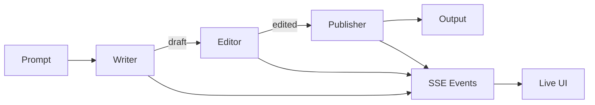

# A2A - Agent-to-Agent Multi-Agent System

Un progetto per esplorare e comprendere come gli agenti AI interagiscono tra loro.

## Obiettivi

Questo progetto nasce per rispondere a domande fondamentali sui sistemi multi-agente:

| Domanda | Soluzione |
|---------|-----------|
| **Come creare agenti facilmente?** | Pattern `think/act/respond` con classe base |
| **Dove salvano le informazioni?** | Storage astratto (memory → file → DB) |
| **Come avviene l'interazione?** | MCP protocol + REST API |
| **Come gestire i permessi?** | Role-based con `@requires_permission` |

## Architettura

```
┌─────────────────┐       ┌─────────────────────────────────┐
│  Claude Desktop │◄─────►│  FastMCP (@mcp.tool)            │
└─────────────────┘       └───────────────┬─────────────────┘
                                          │
┌─────────────────┐       ┌───────────────▼─────────────────┐
│  HTTP Client    │◄─────►│  FastAPI (/api/*)               │
└─────────────────┘       └───────────────┬─────────────────┘
                                          │
┌─────────────────┐       ┌───────────────▼─────────────────┐
│  Browser (SSE)  │◄──────│  Server-Sent Events             │
└─────────────────┘       └───────────────┬─────────────────┘
                                          │
                          ┌───────────────▼─────────────────┐
                          │  Agents                         │
                          │  ├── Simple (Echo, Calc, etc.)  │
                          │  ├── Research (Fan-out/Fan-in)  │
                          │  └── Chain (Writer→Editor→Pub)  │
                          └───────────────┬─────────────────┘
                                          │
                          ┌───────────────▼─────────────────┐
                          │  Storage + Auth + LiteLLM       │
                          └─────────────────────────────────┘
```

## Tech Stack

| Layer | Technology |
|-------|------------|
| Language | Python 3.11+ |
| MCP Server | FastMCP |
| HTTP API | FastAPI |
| Validation | Pydantic v2 |
| Storage | Abstract (memory → file → PostgreSQL) |
| Auth | Role-based permissions |
| LLM | LiteLLM (Claude, OpenAI, etc.) |
| Streaming | Server-Sent Events (SSE) |
| Testing | pytest (Test Pyramid) |
| Container | Docker + Docker Compose |

## Quick Start

```bash
# Clone
git clone https://github.com/lorenzogirardi/a2a.git
cd a2a

# Start with Docker
docker-compose up -d

# Open Chain Pipeline Demo
open http://localhost:8000/static/chain/

# Or install locally
pip install -r requirements.txt
python main.py
```

## Struttura Progetto

```
a2a/
├── agents/
│   ├── base.py          # AgentBase class
│   ├── simple_agent.py  # Echo, Counter, Router, Calculator
│   ├── llm_agent.py     # LLM-based agents (LiteLLM)
│   ├── research/        # Research Assistant (fan-out/fan-in)
│   └── chain/           # Chain Pipeline (sequential)
│       ├── writer.py    # WriterAgent
│       ├── editor.py    # EditorAgent
│       ├── publisher.py # PublisherAgent
│       └── pipeline.py  # ChainPipeline orchestrator
├── storage/
│   ├── base.py          # StorageBase interface
│   ├── memory.py        # MemoryStorage
│   ├── file.py          # FileStorage
│   └── postgres.py      # PostgresStorage
├── auth/
│   └── permissions.py   # Role, Permission, CallerContext
├── protocol/
│   ├── mcp_server.py    # FastMCP server
│   ├── api.py           # FastAPI REST endpoints
│   ├── sse.py           # SSE transport
│   └── chain_router.py  # Chain API endpoints
├── static/
│   └── chain/           # Chain Pipeline Demo UI
│       ├── index.html
│       ├── app.js
│       └── style.css
├── tests/
│   ├── unit/            # 70% - Fast, isolated
│   ├── integration/     # 20% - Components together
│   └── e2e/             # 10% - Full system
├── docs/                # Architecture documentation
├── .claude/             # Claude Code configuration
└── .github/workflows/   # CI/CD pipelines
```

## Agenti Disponibili

### Simple Agents

| Agente | Descrizione |
|--------|-------------|
| `EchoAgent` | Ripete i messaggi ricevuti |
| `CounterAgent` | Conta i messaggi ricevuti |
| `RouterAgent` | Smista messaggi ad altri agenti |
| `CalculatorAgent` | Esegue calcoli matematici |
| `LLMAgent` | Agente basato su Claude API |

### Chain Pipeline Agents

| Agente | Descrizione |
|--------|-------------|
| `WriterAgent` | Genera testo iniziale da un topic |
| `EditorAgent` | Migliora stile, grammatica e chiarezza |
| `PublisherAgent` | Formatta per pubblicazione |

### Research Agents

| Agente | Descrizione |
|--------|-------------|
| `WebSearchAgent` | Ricerca sul web |
| `DocSearchAgent` | Ricerca nella documentazione |
| `CodeSearchAgent` | Ricerca nel codice |
| `OrchestratorAgent` | Coordina ricerche parallele |

## Demo Interattive

### Chain Pipeline Demo

Visualizzazione in tempo reale di agenti che comunicano in sequenza:

```
http://localhost:8000/static/chain/
```

**Features:**
- 📝 Writer → Editor → Publisher pipeline
- 📡 Eventi SSE in tempo reale
- 📊 KPI Dashboard (tokens, durata, costo stimato)
- 💬 Visualizzazione comunicazione tra agenti
- 🔄 Esecuzione con Claude API via LiteLLM



### Research Assistant

Query di ricerca parallela con aggregazione:

```bash
curl "http://localhost:8000/api/research?q=python"
```

## Sistema di Permessi

```python
from auth import user_context, admin_context, guest_context

# User può inviare messaggi
ctx = user_context("mario")
response = await agent.receive_message(ctx, "ciao", "mario")

# Guest può solo leggere
ctx = guest_context("visitor")
state = await agent.get_state(ctx)  # OK
await agent.receive_message(ctx, "hi", "visitor")  # PermissionDenied
```

### Ruoli

| Ruolo | Permessi |
|-------|----------|
| `admin` | Tutti |
| `user` | read, send, create_conversation |
| `guest` | read only |
| `agent` | agent-to-agent communication |

## Comunicazione Agent-to-Agent

```python
# Un agente può parlare con un altro
response = await router.send_to_agent(calculator, "calcola 5 + 3")
```

## Security

Il progetto include una pipeline di security automatica:

| Scanner | Cosa Controlla |
|---------|----------------|
| **Trivy** | Vulnerabilità nelle dipendenze |
| **TruffleHog** | Secrets nel codice/git history |
| **Bandit** | Problemi di sicurezza nel codice Python |
| **pip-audit** | CVE nelle dipendenze |
| **Semgrep** | Analisi statica del codice |

## Development

### Testing (Test Pyramid)

```bash
# Tutti i test
pytest

# Solo unit (feedback veloce)
pytest tests/unit/ -v

# Solo integration
pytest tests/integration/ -v
```

### Security Scan Locale

```bash
# Code security
bandit -r . -x ./tests -ll

# Dependencies
pip-audit

# Secrets
trufflehog filesystem . --only-verified

# Full scan
trivy fs --severity HIGH,CRITICAL .
```

## Claude Code Integration

Il progetto include configurazione `.claude/` per Claude Code:

- **CLAUDE.md**: Convenzioni e regole del progetto
- **status.md**: Stato avanzamento (leggere/aggiornare sempre)
- **skills/**: Python, MCP, SCM, Security, Spec-driven-dev

## License

MIT

## Contributing

1. Leggi `.claude/CLAUDE.md` per le convenzioni
2. Segui il Test Pyramid (Unit 70%, Integration 20%, E2E 10%)
3. Usa Conventional Commits
4. Assicurati che la security pipeline passi
