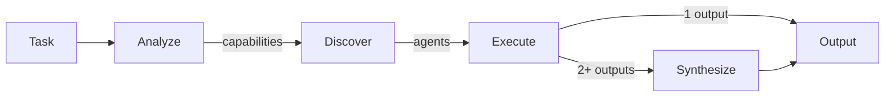
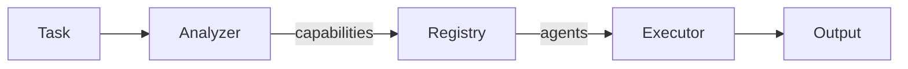

# A2A - Agent-to-Agent Multi-Agent System

Un progetto per esplorare e comprendere come gli agenti AI interagiscono tra loro.

## Obiettivi

Questo progetto nasce per rispondere a domande fondamentali sui sistemi multi-agente:

| Domanda | Soluzione |
|---------|-----------|
| **Come creare agenti facilmente?** | Pattern `think/act/respond` con classe base |
| **Dove salvano le informazioni?** | Storage astratto (memory → file → DB) |
| **Come avviene l'interazione?** | MCP protocol + REST API |
| **Come gestire i permessi?** | Role-based con `@requires_permission` |

## Architettura

```
┌─────────────────┐       ┌─────────────────────────────────┐
│  Claude Desktop │◄─────►│  FastMCP (@mcp.tool)            │
└─────────────────┘       └───────────────┬─────────────────┘
                                          │
┌─────────────────┐       ┌───────────────▼─────────────────┐
│  HTTP Client    │◄─────►│  FastAPI (/api/*)               │
└─────────────────┘       └───────────────┬─────────────────┘
                                          │
┌─────────────────┐       ┌───────────────▼─────────────────┐
│  Browser (SSE)  │◄──────│  Server-Sent Events             │
└─────────────────┘       └───────────────┬─────────────────┘
                                          │
                          ┌───────────────▼─────────────────┐
                          │  LangGraph Orchestration        │
                          │  Analyze → Discover → Execute   │
                          │              ↓                  │
                          │          Synthesize             │
                          └───────────────┬─────────────────┘
                                          │
                          ┌───────────────▼─────────────────┐
                          │  Agents                         │
                          │  ├── Simple (Echo, Calc, etc.)  │
                          │  ├── Research (Fan-out/Fan-in)  │
                          │  ├── Chain (Writer→Editor→Pub)  │
                          │  └── Specialists (Analysis,     │
                          │       Estimation, Research...)  │
                          └───────────────┬─────────────────┘
                                          │
                          ┌───────────────▼─────────────────┐
                          │  Storage + Auth + LiteLLM       │
                          └─────────────────────────────────┘
```

## Tech Stack

| Layer | Technology |
|-------|------------|
| Language | Python 3.11+ |
| Orchestration | **LangGraph** (DAG-based) |
| MCP Server | FastMCP |
| HTTP API | FastAPI |
| Validation | Pydantic v2 |
| Storage | Abstract (memory → file → PostgreSQL) |
| Auth | Role-based permissions |
| LLM | Anthropic SDK (direct) |
| Streaming | Server-Sent Events (SSE) |
| Visualization | vis.js (real-time graph) |
| Testing | pytest (Test Pyramid) |
| Container | Docker + Docker Compose |

> **Nota**: Usiamo LangGraph per l'orchestrazione DAG, ma **non LangChain**. Le chiamate LLM usano direttamente Anthropic SDK per semplicità e controllo. Vedi [architectural decision](docs/software-architecture/langgraph-pattern.md#architectural-decision-why-langgraph-but-not-langchain).

## Quick Start

```bash
# Clone
git clone https://github.com/lorenzogirardi/a2a.git
cd a2a

# Start with Docker
docker-compose up -d

# Open LangGraph Visualizer (recommended)
open http://localhost:8000/static/graph/

# Or Chain Pipeline Demo
open http://localhost:8000/static/chain/

# Or install locally
pip install -r requirements.txt
python main.py
```

## Struttura Progetto

```
a2a/
├── agents/
│   ├── base.py          # AgentBase class
│   ├── simple_agent.py  # Echo, Counter, Router, Calculator
│   ├── llm_agent.py     # LLM-based agents
│   ├── registry.py      # AgentRegistry for discovery
│   ├── research/        # Research Assistant (fan-out/fan-in)
│   ├── chain/           # Chain Pipeline (sequential)
│   ├── router/          # Smart Router + Specialists
│   │   ├── analyzer.py      # AnalyzerAgent (capability detection)
│   │   ├── synthesizer.py   # SynthesizerAgent (output integration)
│   │   └── specialist_agents.py  # Research, Estimation, Analysis...
│   └── graph/           # LangGraph Integration
│       ├── state.py     # GraphState TypedDict
│       ├── nodes.py     # Analyze, Discover, Execute, Synthesize
│       ├── graph.py     # StateGraph builder
│       └── runner.py    # GraphRunner with SSE streaming
├── storage/
│   ├── base.py          # StorageBase interface
│   ├── memory.py        # MemoryStorage
│   ├── file.py          # FileStorage
│   └── postgres.py      # PostgresStorage
├── auth/
│   └── permissions.py   # Role, Permission, CallerContext
├── protocol/
│   ├── mcp_server.py    # FastMCP server
│   ├── api.py           # FastAPI REST endpoints
│   ├── sse.py           # SSE transport
│   └── chain_router.py  # Chain API endpoints
├── static/
│   ├── chain/           # Chain Pipeline Demo UI
│   └── graph/           # LangGraph Visualizer
│       ├── index.html
│       ├── app.js       # vis.js + SSE integration
│       └── style.css
├── tests/
│   ├── unit/            # 70% - Fast, isolated
│   ├── integration/     # 20% - Components together
│   └── e2e/             # 10% - Full system
├── docs/                # Architecture documentation
├── .claude/             # Claude Code configuration
└── .github/workflows/   # CI/CD pipelines
```

## Agenti Disponibili

### Simple Agents

| Agente | Descrizione |
|--------|-------------|
| `EchoAgent` | Ripete i messaggi ricevuti |
| `CounterAgent` | Conta i messaggi ricevuti |
| `RouterAgent` | Smista messaggi ad altri agenti |
| `CalculatorAgent` | Esegue calcoli matematici |
| `LLMAgent` | Agente basato su Claude API |

### Chain Pipeline Agents

| Agente | Descrizione |
|--------|-------------|
| `WriterAgent` | Genera testo iniziale da un topic |
| `EditorAgent` | Migliora stile, grammatica e chiarezza |
| `PublisherAgent` | Formatta per pubblicazione |

### Research Agents

| Agente | Descrizione |
|--------|-------------|
| `WebSearchAgent` | Ricerca sul web |
| `DocSearchAgent` | Ricerca nella documentazione |
| `CodeSearchAgent` | Ricerca nel codice |
| `OrchestratorAgent` | Coordina ricerche parallele |

### Specialist Agents (LangGraph)

| Agente | Capability | Descrizione |
|--------|------------|-------------|
| `AnalyzerAgent` | - | Estrae capabilities dal task |
| `ResearchAgent` | `research` | Ricerca informazioni |
| `EstimationAgent` | `estimation` | Stime costi/tempi |
| `AnalysisAgent` | `analysis` | Analisi pro/contro |
| `TranslationAgent` | `translation` | Traduzione testi |
| `SummaryAgent` | `summary` | Riassunto testi |
| `SynthesizerAgent` | - | Integra output multipli |

## Demo Interattive

### Chain Pipeline Demo

Visualizzazione in tempo reale di agenti che comunicano in sequenza:

```
http://localhost:8000/static/chain/
```

**Features:**
- 📝 Writer → Editor → Publisher pipeline
- 📡 Eventi SSE in tempo reale
- 📊 KPI Dashboard (tokens, durata, costo stimato)
- 💬 Visualizzazione comunicazione tra agenti
- 🔄 Esecuzione con Claude API via LiteLLM


### LangGraph Execution Visualizer

Orchestrazione DAG con visualizzazione real-time:

```bash
open http://localhost:8000/static/graph/
```

[](https://res.cloudinary.com/ethzero/video/upload/v1769976053/ai/a2a/agent-discovery-graph.mp4)

*Clicca per vedere il video demo*

**Features:**
- 🔄 DAG orchestration con LangGraph
- 🎯 Selezione automatica agenti per capability
- ⚡ Esecuzione parallela con `asyncio.gather`
- 🔀 Conditional routing (synthesize se 2+ output)
- 📊 Visualizzazione real-time con vis.js
- 📡 SSE per aggiornamenti live



**Come funziona la selezione agenti:**

1. **Analyze**: LLM estrae capabilities dal task (es. "budget" → `estimation`)
2. **Discover**: Registry cerca agenti che dichiarano quella capability
3. **Execute**: Agenti eseguiti in parallelo sui rispettivi subtask
4. **Synthesize**: Se 2+ risposte, LLM le integra in un output coerente

Vedi [documentazione dettagliata](docs/software-architecture/langgraph-execution-example.md).

### Smart Task Router

Routing intelligente basato su capability:

```bash
open http://localhost:8000/static/router/
```

**Features:**
- 🔍 Analisi task con LLM
- 📋 Discovery agenti via Registry
- ⚡ Esecuzione parallela subtask
- 🎯 Matching capability-based



### Research Assistant

Query di ricerca parallela con aggregazione:

```bash
curl "http://localhost:8000/api/research?q=python"
```

## Sistema di Permessi

```python
from auth import user_context, admin_context, guest_context

# User può inviare messaggi
ctx = user_context("mario")
response = await agent.receive_message(ctx, "ciao", "mario")

# Guest può solo leggere
ctx = guest_context("visitor")
state = await agent.get_state(ctx)  # OK
await agent.receive_message(ctx, "hi", "visitor")  # PermissionDenied
```

### Ruoli

| Ruolo | Permessi |
|-------|----------|
| `admin` | Tutti |
| `user` | read, send, create_conversation |
| `guest` | read only |
| `agent` | agent-to-agent communication |

## Comunicazione Agent-to-Agent

```python
# Un agente può parlare con un altro
response = await router.send_to_agent(calculator, "calcola 5 + 3")
```

## Security

Il progetto include una pipeline di security automatica:

| Scanner | Cosa Controlla |
|---------|----------------|
| **Trivy** | Vulnerabilità nelle dipendenze |
| **TruffleHog** | Secrets nel codice/git history |
| **Bandit** | Problemi di sicurezza nel codice Python |
| **pip-audit** | CVE nelle dipendenze |
| **Semgrep** | Analisi statica del codice |

## Development

### Testing (Test Pyramid)

```bash
# Tutti i test
pytest

# Solo unit (feedback veloce)
pytest tests/unit/ -v

# Solo integration
pytest tests/integration/ -v
```

### Security Scan Locale

```bash
# Code security
bandit -r . -x ./tests -ll

# Dependencies
pip-audit

# Secrets
trufflehog filesystem . --only-verified

# Full scan
trivy fs --severity HIGH,CRITICAL .
```

## Claude Code Integration

Il progetto include configurazione `.claude/` per Claude Code:

- **CLAUDE.md**: Convenzioni e regole del progetto
- **status.md**: Stato avanzamento (leggere/aggiornare sempre)
- **skills/**: Python, MCP, SCM, Security, Spec-driven-dev

## License

MIT

## Contributing

1. Leggi `.claude/CLAUDE.md` per le convenzioni
2. Segui il Test Pyramid (Unit 70%, Integration 20%, E2E 10%)
3. Usa Conventional Commits
4. Assicurati che la security pipeline passi
