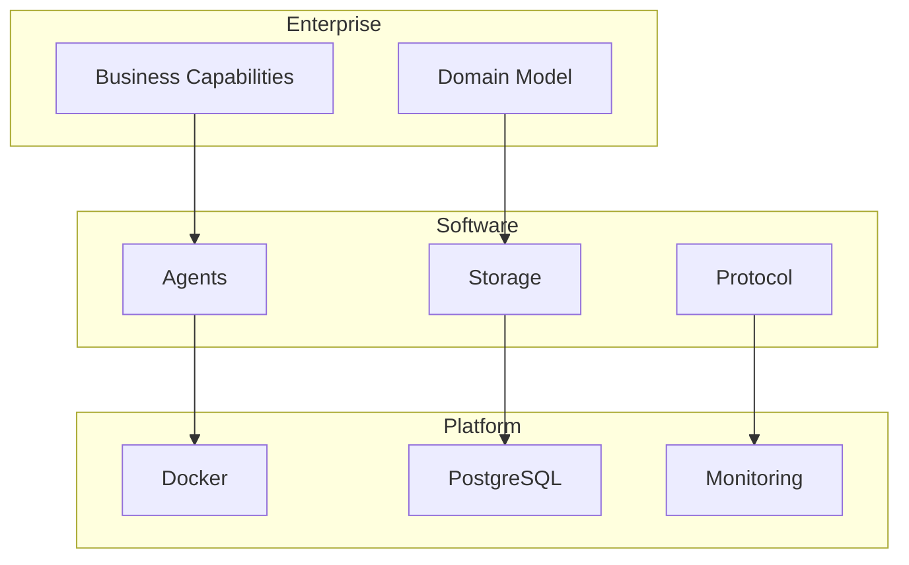

# A2A Documentation

Agent-to-Agent communication and orchestration framework.

## Quick Links

| I want to... | Go to |
|--------------|-------|
| Understand the business context | [Enterprise Architecture](enterprise-architecture/) |
| See how components work | [Software Architecture](software-architecture/) |
| Deploy and operate | [Platform Architecture](platform-architecture/) |

## Architecture Overview



## Structure

```
docs/
├── enterprise-architecture/
│   ├── README.md          # Business capabilities, domain model
│   └── adr/               # Architecture Decision Records
├── software-architecture/
│   ├── README.md          # Components, patterns, APIs
│   ├── chain-pattern.md   # Chain Pipeline Demo documentation
│   └── router-pattern.md  # Smart Router Demo documentation
└── platform-architecture/
    └── README.md          # Docker, database, operations
```

## Key Concepts

| Concept | Description |
|---------|-------------|
| **Agent** | Autonomous unit that receives messages, thinks, acts, responds |
| **Storage** | Pluggable persistence (Memory, File, PostgreSQL) |
| **Protocol** | Communication layer (MCP, REST, SSE) |
| **CallerContext** | Identity and permissions of the caller |

## Getting Started

```bash
# Start the system
docker-compose up -d

# Check health
curl http://localhost:8000/health

# Try research API
curl "http://localhost:8000/api/research?q=python"
```

## Demos

### Chain Pipeline Demo

Interactive visualization of sequential agent communication:

```bash
open http://localhost:8000/static/chain/
```

**Features:**
- Writer → Editor → Publisher pipeline
- Real-time SSE events
- KPI dashboard (tokens, duration, cost)
- Agent communication visualization

See: [Chain Pattern Documentation](software-architecture/chain-pattern.md)

### Smart Task Router Demo

Interactive visualization of capability-based agent discovery:

```bash
open http://localhost:8000/static/router/
```

**Features:**
- 3-step flow: Analyze → Discover → Execute
- LLM-based task analysis
- Registry-based agent discovery
- Multi-capability task routing

See: [Router Pattern Documentation](software-architecture/router-pattern.md)
