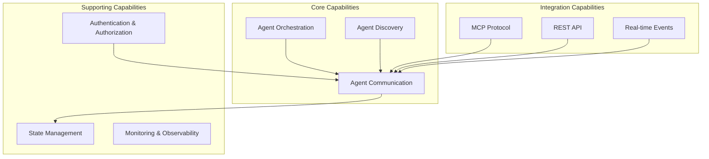
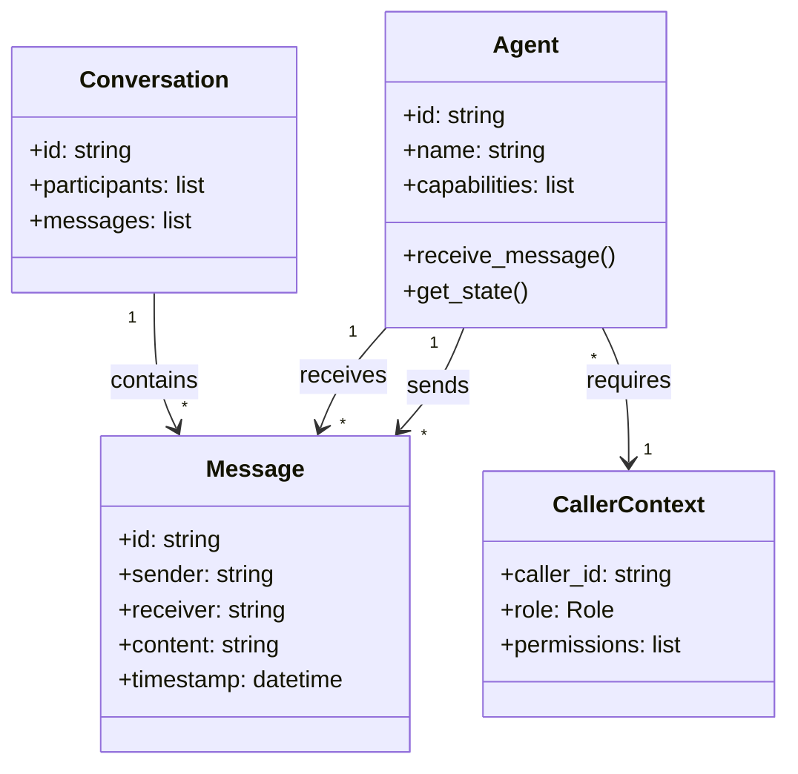

# Enterprise Architecture

## Overview

A2A (Agent-to-Agent) è un framework per la comunicazione e orchestrazione di agenti AI.

## Business Capabilities

## Domain Model

## Stakeholders

| Stakeholder | Concerns | How Addressed |
|-------------|----------|---------------|
| Developers | Easy agent creation | Simple base class, decorators |
| Operators | Deployment, monitoring | Docker, health endpoints |
| Security | Access control | Role-based permissions |
| Integrators | Protocol compatibility | MCP, REST, SSE support |

## Strategic Decisions

See [ADR-001: Agent Pattern](adr/001-agent-pattern.md)
