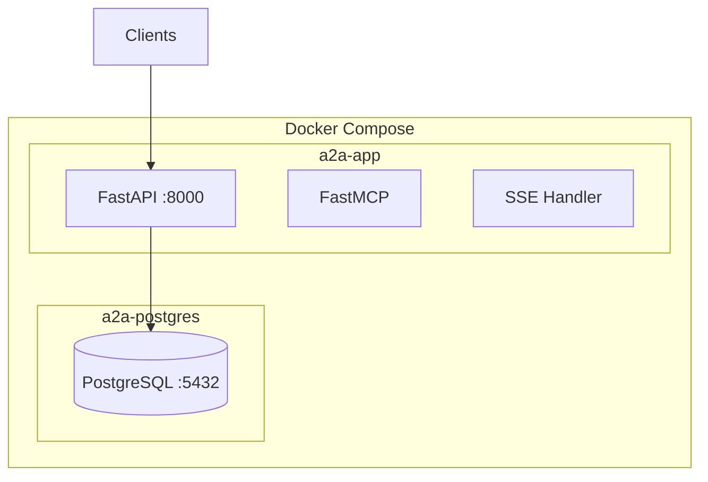
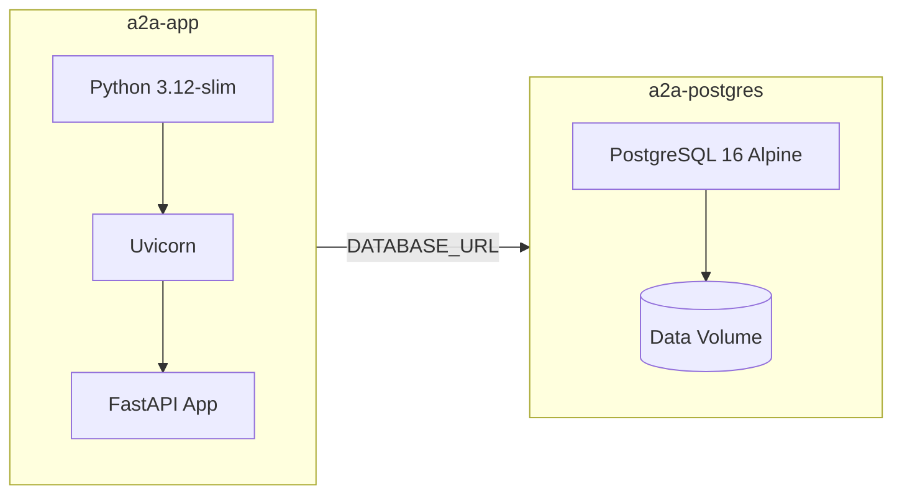
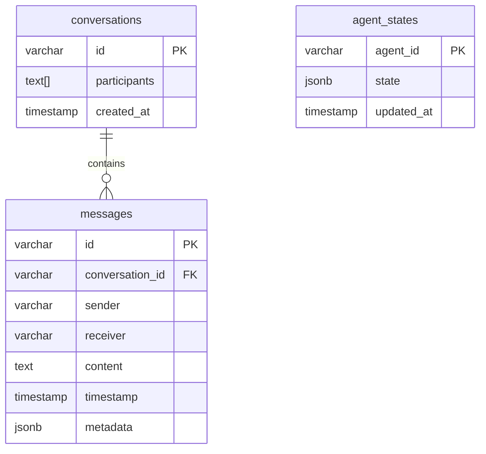
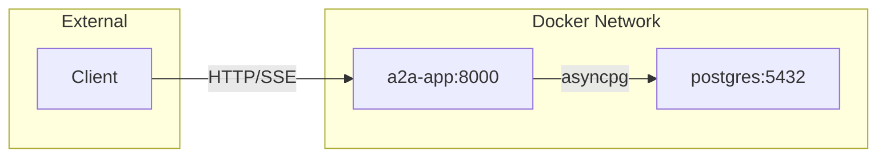
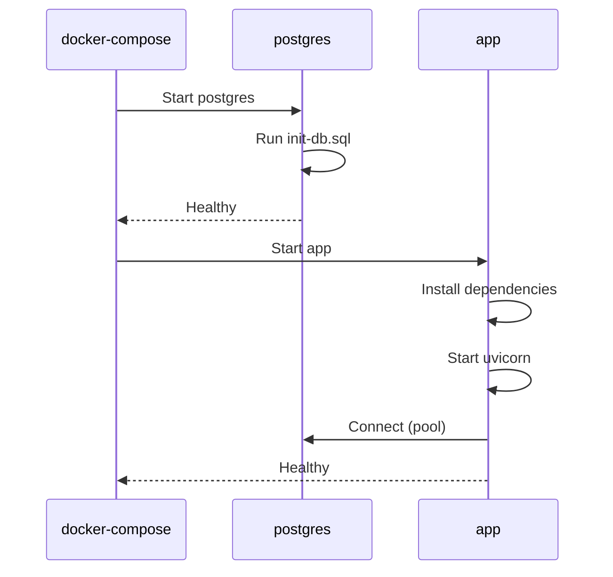
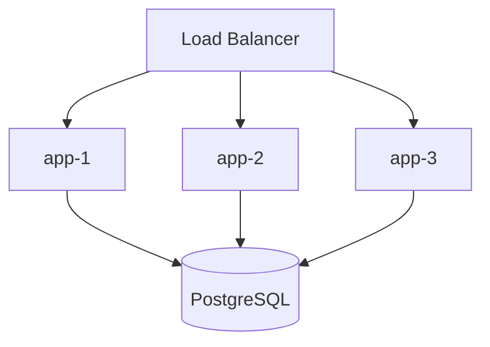

# Platform Architecture

## Deployment Overview



## Container Architecture



## Docker Compose Services

| Service | Image | Ports | Health Check |
|---------|-------|-------|--------------|
| `app` | `a2a-app` (built) | 8000 | `curl /health` |
| `postgres` | `postgres:16-alpine` | 5432 | `pg_isready` |

## Environment Variables

| Variable | Default | Description |
|----------|---------|-------------|
| `HOST` | `0.0.0.0` | API bind address |
| `PORT` | `8000` | API port |
| `DATABASE_URL` | - | PostgreSQL connection string |
| `ANTHROPIC_API_KEY` | - | Claude API key (for LLM agents) |

## Database Schema



## Network Flow



## Startup Sequence



## Operations

### Start

```bash
docker-compose up -d
```

### Logs

```bash
docker-compose logs -f app
docker-compose logs -f postgres
```

### Stop

```bash
docker-compose down
```

### Reset Database

```bash
docker-compose down -v
docker-compose up -d
```

## Monitoring

### Health Endpoints

| Endpoint | Description |
|----------|-------------|
| `GET /health` | App health + agent count |
| `GET /sse/status` | SSE connection count |

### Logs

```bash
# All logs
docker-compose logs

# Follow app logs
docker-compose logs -f app

# Last 100 lines
docker-compose logs --tail=100
```

## Security

### Network Isolation

- PostgreSQL not exposed externally (internal Docker network)
- App exposes only port 8000

### Authentication

- Role-based access (Admin, User, Guest)
- CallerContext required for all operations
- Permission decorators on sensitive methods

### Secrets

| Secret | Storage | Usage |
|--------|---------|-------|
| `POSTGRES_PASSWORD` | docker-compose.yml | DB access |
| `ANTHROPIC_API_KEY` | Environment | Claude API |

## Scaling Considerations

### Current (Single Node)

```
docker-compose up -d
```

### Future (Multi-Node)



Requirements for scaling:
- Shared PostgreSQL (already supported)
- Session affinity for SSE connections
- Distributed agent state (Redis/PostgreSQL)
