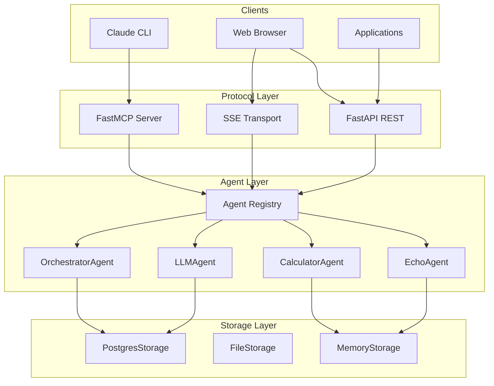
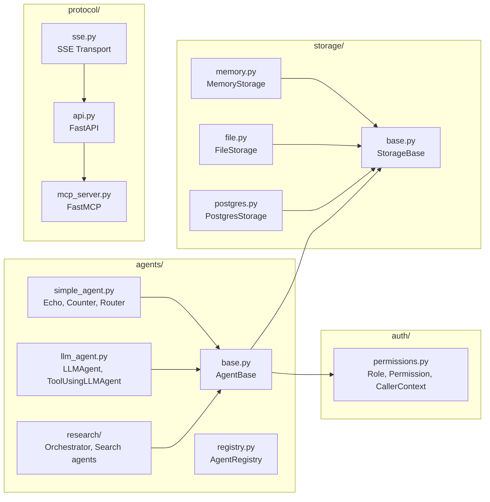
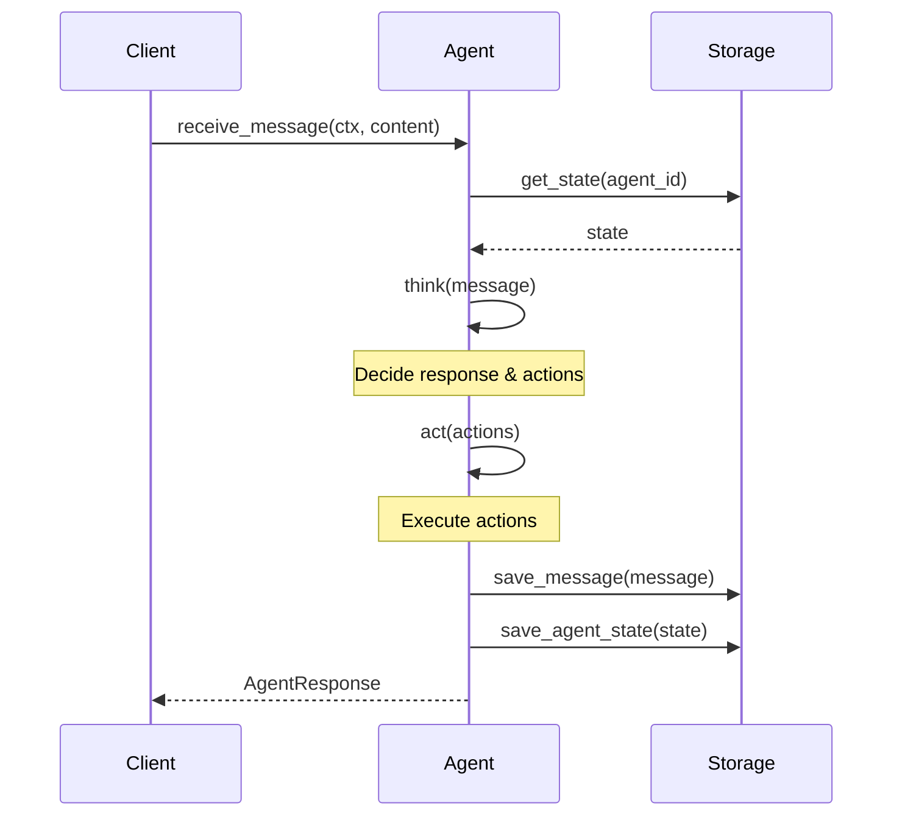
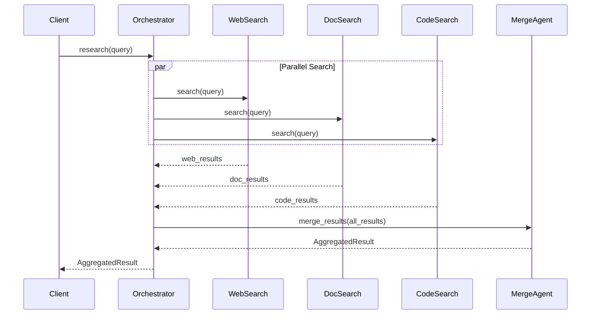
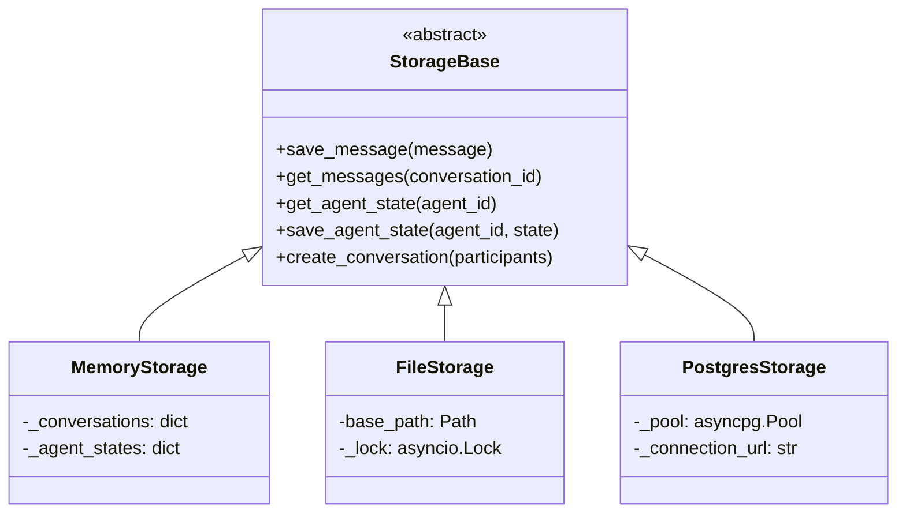
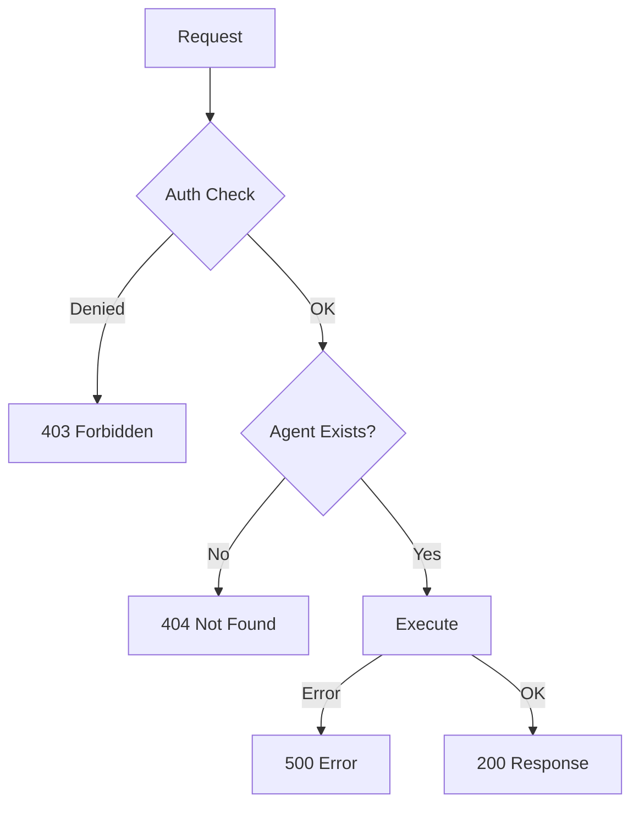

# Software Architecture

## System Overview

## Component Diagram

## Agent Pattern

## Research Orchestration (Fan-out/Fan-in)

## Storage Abstraction

## API Endpoints

| Method | Path | Description |
|--------|------|-------------|
| GET | `/health` | Health check |
| GET | `/api/agents` | List all agents |
| GET | `/api/agents/{id}` | Get agent info |
| POST | `/api/agents/{id}/message` | Send message |
| GET | `/api/agents/{id}/state` | Get agent state |
| GET | `/api/research?q=...` | Research query |
| GET | `/sse/events` | SSE stream |
| POST | `/sse/call` | Call tool via SSE |

## Error Handling

