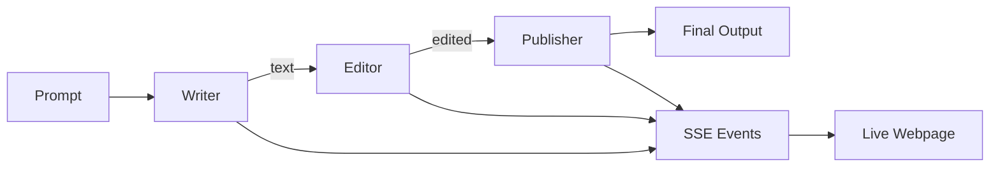
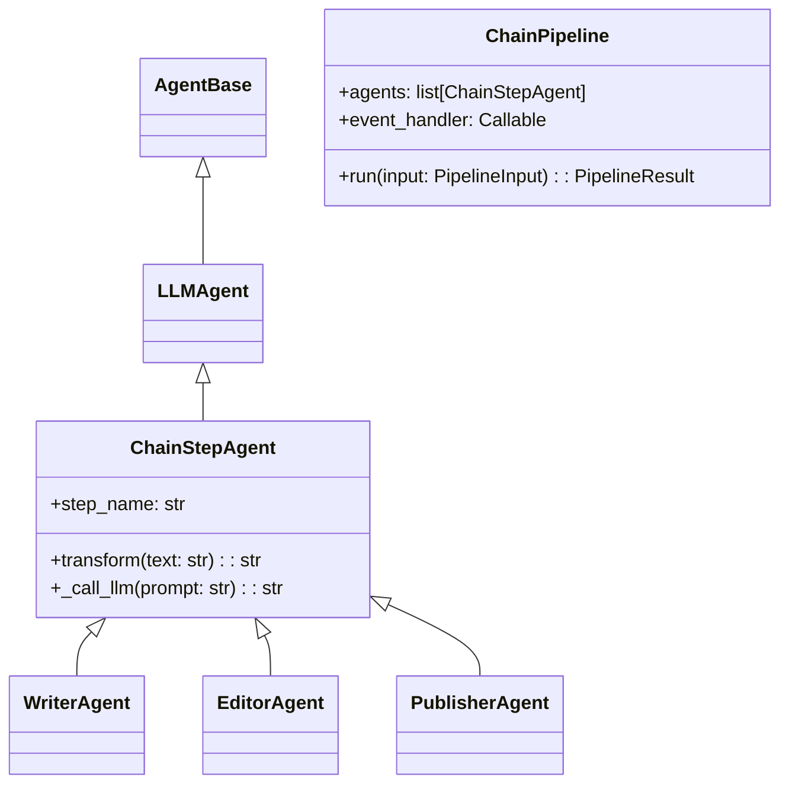

# Chain Pipeline Pattern

## Overview

The Chain Pipeline pattern demonstrates **sequential agent communication** where each agent transforms its input and passes the result to the next agent in the chain.



## Use Case: Document Processing

The demo implements a document processing pipeline:

1. **WriterAgent** - Generates initial draft text from a topic
2. **EditorAgent** - Improves style, grammar, and clarity
3. **PublisherAgent** - Formats for publication with title and sections

---

## Complete Example: "Il futuro della moda sostenibile"

This section shows **real output** from a pipeline execution, demonstrating how each agent transforms the content.

### Input

```
Prompt: "Il futuro della moda sostenibile"
```

---

### Step 1: WriterAgent

**Role**: Content generation - creates initial draft from topic

| Metric | Value |
|--------|-------|
| Duration | 9.2s |
| Input Tokens | 91 |
| Output Tokens | 431 |
| Model | claude-sonnet-4-5 |

**System Prompt**:
> "Sei uno scrittore professionista. Quando ricevi un topic, genera un testo iniziale di 2-3 paragrafi. Sii creativo ma informativo."

**Output**:

```markdown
# Il futuro della moda sostenibile

La moda sostenibile non è più un'opzione di nicchia, ma sta diventando
rapidamente il nuovo standard dell'industria tessile globale. Mentre i
consumatori diventano sempre più consapevoli dell'impatto ambientale delle
loro scelte d'acquisto, i brand sono costretti a ripensare radicalmente i
loro processi produttivi. Dalle fibre innovative ricavate da scarti
alimentari ai sistemi di economia circolare che trasformano vecchi capi in
nuove collezioni, l'industria della moda sta vivendo una rivoluzione
silenziosa ma profonda. La sfida principale resta quella di bilanciare
sostenibilità, accessibilità economica e desiderabilità estetica, tre
elementi che storicamente hanno faticato a convivere.

Il futuro della moda sostenibile passa attraverso l'innovazione tecnologica
e un cambiamento culturale nel modo in cui concepiamo il consumo di
abbigliamento. La blockchain sta permettendo una tracciabilità totale della
filiera produttiva, mentre l'intelligenza artificiale ottimizza la
produzione riducendo gli sprechi. Ma la vera rivoluzione risiede
nell'adozione di modelli di business alternativi: dal noleggio di abiti di
alta gamma alla riparazione professionale dei capi danneggiati, fino ai
marketplace di seconda mano che stanno sdoganando l'usato come scelta di
stile e non più di necessità. Entro il 2030, gli esperti prevedono che
almeno il 60% dei consumatori globali privilegerà brand con credenziali
ambientali verificate, trasformando la sostenibilità da vantaggio
competitivo a requisito minimo per sopravvivere nel mercato.
```

**What the Writer did**:
- Generated 2 paragraphs from the topic
- Introduced key concepts (circular economy, blockchain, AI)
- Added statistics (60% by 2030)
- Created engaging, informative content

---

### Step 2: EditorAgent

**Role**: Quality improvement - refines grammar, style, clarity

| Metric | Value |
|--------|-------|
| Duration | 4.6s |
| Input Tokens | 534 |
| Output Tokens | 428 |
| Model | claude-sonnet-4-5 |

**System Prompt**:
> "Sei un editor professionista. Correggi errori grammaticali, migliora lo stile e la fluidità, rendi il testo più chiaro e conciso. Mantieni il significato originale."

**Changes Made** (diff from Writer's output):

```diff
- Mentre i consumatori diventano sempre più consapevoli
+ Mentre i consumatori acquisiscono maggiore consapevolezza

- i brand sono costretti a ripensare radicalmente i loro processi produttivi
+ i brand sono costretti a ripensare radicalmente i processi produttivi

- La sfida principale resta quella di bilanciare
+ La sfida principale resta bilanciare

- tre elementi che storicamente hanno faticato a convivere.
+ tre elementi che storicamente hanno faticato a convivere:

- La blockchain sta permettendo
+ La blockchain consente

- requisito minimo per sopravvivere nel mercato
+ requisito minimo per la sopravvivenza sul mercato
```

**What the Editor did**:
- Improved verb choices ("acquisiscono" vs "diventano")
- Removed redundant words ("loro", "quella di")
- Enhanced punctuation (colon for list introduction)
- Made phrases more concise
- Preserved all original meaning and content

---

### Step 3: PublisherAgent

**Role**: Formatting - structures document for publication

| Metric | Value |
|--------|-------|
| Duration | 5.7s |
| Input Tokens | 529 |
| Output Tokens | 550 |
| Model | claude-sonnet-4-5 |

**System Prompt**:
> "Sei un publisher professionista. Formatta per la pubblicazione: aggiungi titolo, organizza in sezioni, aggiungi conclusione. Usa markdown."

**Final Output**:

```markdown
# Il futuro della moda sostenibile

## Una rivoluzione in corso nell'industria tessile

La moda sostenibile non è più un'opzione di nicchia, ma sta diventando
rapidamente il nuovo standard dell'industria tessile globale. Mentre i
consumatori acquisiscono maggiore consapevolezza dell'impatto ambientale
delle loro scelte d'acquisto, i brand sono costretti a ripensare
radicalmente i processi produttivi.

Dalle fibre innovative ricavate da scarti alimentari ai sistemi di economia
circolare che trasformano vecchi capi in nuove collezioni, l'industria della
moda sta vivendo una rivoluzione silenziosa ma profonda. La sfida principale
resta bilanciare sostenibilità, accessibilità economica e desiderabilità
estetica: tre elementi che storicamente hanno faticato a convivere.

## Tecnologia e nuovi modelli di business

Il futuro della moda sostenibile passa attraverso l'innovazione tecnologica
e un cambiamento culturale nel modo in cui concepiamo il consumo di
abbigliamento. La **blockchain** consente una tracciabilità totale della
filiera produttiva, mentre l'**intelligenza artificiale** ottimizza la
produzione riducendo gli sprechi.

Ma la vera rivoluzione risiede nell'adozione di modelli di business
alternativi:

- **Noleggio di abiti di alta gamma** - un'alternativa al possesso
- **Riparazione professionale** - dare nuova vita ai capi danneggiati
- **Marketplace di seconda mano** - l'usato come scelta di stile consapevole

## Conclusione

Entro il 2030, gli esperti prevedono che almeno il 60% dei consumatori
globali privilegerà brand con credenziali ambientali verificate,
trasformando la sostenibilità da vantaggio competitivo a requisito minimo
per la sopravvivenza sul mercato.

La moda sostenibile non rappresenta semplicemente una tendenza passeggera,
ma una trasformazione irreversibile del settore: un nuovo paradigma in cui
stile, etica e innovazione convergono per ridefinire il nostro rapporto con
l'abbigliamento.
```

**What the Publisher did**:
- Added section headers (`##`)
- Created bullet list for business models
- Added **bold** for key terms
- Split long paragraphs for readability
- Added new conclusion paragraph
- Structured document with clear hierarchy

---

### Pipeline Summary

```
┌────────────────────────────────────────────────────────────────────────┐
│                    PIPELINE EXECUTION SUMMARY                          │
├────────────────────────────────────────────────────────────────────────┤
│  Input: "Il futuro della moda sostenibile"                             │
├──────────────┬──────────┬──────────────┬───────────────┬───────────────┤
│    Agent     │ Duration │ Input Tokens │ Output Tokens │    Action     │
├──────────────┼──────────┼──────────────┼───────────────┼───────────────┤
│ WriterAgent  │   9.2s   │      91      │      431      │ Generate      │
│ EditorAgent  │   4.6s   │     534      │      428      │ Improve       │
│ PublisherAgent│  5.7s   │     529      │      550      │ Format        │
├──────────────┼──────────┼──────────────┼───────────────┼───────────────┤
│    TOTAL     │  19.5s   │    1,154     │     1,409     │               │
└──────────────┴──────────┴──────────────┴───────────────┴───────────────┘

Total Tokens: 2,563
Estimated Cost: ~$0.02 (at $3/1M input, $15/1M output)
```

---

## Architecture

### Components

```
agents/chain/
├── __init__.py       # Public exports
├── models.py         # Pydantic models
├── base.py           # ChainStepAgent base class
├── writer.py         # WriterAgent
├── editor.py         # EditorAgent
├── publisher.py      # PublisherAgent
└── pipeline.py       # ChainPipeline orchestrator
```

### Class Hierarchy



## Data Models

### TokenUsage

```python
class TokenUsage(BaseModel):
    input_tokens: int = 0          # Tokens sent to LLM
    output_tokens: int = 0         # Tokens received from LLM

    @property
    def total_tokens(self) -> int:
        return self.input_tokens + self.output_tokens
```

### PipelineInput

```python
class PipelineInput(BaseModel):
    prompt: str                    # Topic to write about
    pipeline_id: str = auto()      # Unique identifier
    steps: list[str] = ["writer", "editor", "publisher"]
```

### StepResult

```python
class StepResult(BaseModel):
    step_name: str                 # "writer", "editor", "publisher"
    step_index: int                # 0, 1, 2
    input_text: str                # What the step received
    output_text: str               # What the step produced
    duration_ms: int               # Execution time
    model: str = ""                # LLM model used
    tokens: TokenUsage             # Token usage for this step
    timestamp: datetime
```

### PipelineResult

```python
class PipelineResult(BaseModel):
    pipeline_id: str
    prompt: str
    steps: list[StepResult]
    final_output: str
    total_duration_ms: int
    status: "pending" | "running" | "completed" | "failed"
    error: Optional[str]
```

### TransformResult (Internal)

```python
@dataclass
class TransformResult:
    text: str                      # Transformed text output
    model: str = ""                # Model used (e.g., "claude-sonnet-4-20250514")
    input_tokens: int = 0          # Input token count
    output_tokens: int = 0         # Output token count
```

## Agent Communication Pattern

### How Do Agents Communicate?

In the Chain Pipeline, agents **do not communicate directly** with each other. The `ChainPipeline` acts as a **mediator/orchestrator** that manages all data flow:

```
┌──────────────────────────────────────────────────────────────────┐
│                      ChainPipeline                               │
│                      (Orchestrator)                              │
├──────────────────────────────────────────────────────────────────┤
│                                                                  │
│   current_text = prompt                                          │
│         │                                                        │
│         ▼                                                        │
│   ┌─────────────┐                                                │
│   │   Writer    │  output = await agent.transform(current_text)  │
│   └─────────────┘                                                │
│         │                                                        │
│   current_text = output  ◄── passes output to next agent         │
│         │                                                        │
│         ▼                                                        │
│   ┌─────────────┐                                                │
│   │   Editor    │  output = await agent.transform(current_text)  │
│   └─────────────┘                                                │
│         │                                                        │
│   current_text = output                                          │
│         │                                                        │
│         ▼                                                        │
│   ┌─────────────┐                                                │
│   │  Publisher  │  output = await agent.transform(current_text)  │
│   └─────────────┘                                                │
│         │                                                        │
│         ▼                                                        │
│   return final_output                                            │
│                                                                  │
└──────────────────────────────────────────────────────────────────┘
```

### Key Code (pipeline.py)

```python
async def run(self, input_data: PipelineInput) -> PipelineResult:
    current_text = input_data.prompt

    for index, agent in enumerate(self.agents):
        # Execute the step
        transform_result = await agent.transform_with_metadata(current_text)
        output_text = transform_result.text

        # Emit SSE event for UI
        self._emit_event("message_passed", {
            "from_step": agent.step_name,
            "to_step": self.agents[index + 1].step_name,
            "content": output_text
        })

        # Pass output to next step
        current_text = output_text  # ← This is the "communication"

    return PipelineResult(final_output=current_text, ...)
```

### Design Pattern: Mediator

| Aspect | Description |
|--------|-------------|
| **Pattern** | Mediator / Orchestrator |
| **Coupling** | Agents are **decoupled** - they don't know each other |
| **Flow Control** | Pipeline controls execution order |
| **Communication** | Indirect via `current_text` variable |
| **Advantages** | Easy to add/remove/reorder agents |

### Why This Pattern?

1. **Decoupling**: Agents have no dependencies on each other
2. **Testability**: Each agent can be tested in isolation
3. **Flexibility**: Easy to add, remove, or reorder steps
4. **Observability**: Pipeline can emit events at each transition
5. **Error Handling**: Centralized error management

### Alternative: Direct Agent Communication

The A2A framework also supports **peer-to-peer** communication via `send_to_agent()`:

```python
# Direct agent-to-agent communication (not used in Chain Pipeline)
class AgentA(AgentBase):
    async def think(self, message):
        # AgentA directly calls AgentB
        response = await self.send_to_agent(agent_b, "help me with this")
        return {"response": response.content}
```

| Pattern | Use Case |
|---------|----------|
| **Mediator** (Chain) | Sequential processing, clear flow |
| **Peer-to-Peer** | Dynamic collaboration, complex workflows |

The Chain Pipeline uses the **Mediator pattern** because it provides clear visibility into the document transformation process.

---

## SSE Events

The pipeline broadcasts events via Server-Sent Events for real-time visualization:

| Event | Data | When |
|-------|------|------|
| `pipeline_started` | `{pipeline_id, prompt, steps[]}` | Pipeline begins |
| `step_started` | `{pipeline_id, step_index, step_name, model, input_preview, input_length}` | Agent starts |
| `step_completed` | `{pipeline_id, step_index, step_name, model, output, duration_ms, input_tokens, output_tokens, total_tokens}` | Agent finishes |
| `message_passed` | `{pipeline_id, from_step, to_step, content, content_length}` | Data flows |
| `pipeline_completed` | `{pipeline_id, status, final_output, total_duration_ms, error}` | Pipeline ends |
| `result` | `{pipeline_id, status, final_output, total_duration_ms, total_input_tokens, total_output_tokens}` | Final result |

## API Endpoints

| Method | Path | Description |
|--------|------|-------------|
| `POST` | `/api/chain/run` | Start pipeline with prompt |
| `GET` | `/api/chain/status/{id}` | Get pipeline status/result |
| `GET` | `/api/chain/agents` | List chain agents |
| `GET` | `/api/chain/events/{id}` | SSE stream for events |
| `GET` | `/static/chain/` | Demo webpage |

### Example: Run Pipeline

```bash
# Start pipeline
curl -X POST http://localhost:8000/api/chain/run \
  -H "Content-Type: application/json" \
  -d '{"prompt": "The impact of AI on healthcare"}'

# Response
{
  "pipeline_id": "abc12345",
  "status": "started",
  "message": "Pipeline started. Connect to /api/chain/events/abc12345 for updates."
}
```

### Example: SSE Events

```bash
curl -N http://localhost:8000/api/chain/events/abc12345

# Output (streaming)
event: connected
data: {"pipeline_id": "abc12345", "timestamp": "..."}

event: pipeline_started
data: {"pipeline_id": "abc12345", "prompt": "The impact...", "steps": ["writer", "editor", "publisher"]}

event: step_started
data: {"pipeline_id": "abc12345", "step_index": 0, "step_name": "writer", "input_preview": "The impact..."}

event: step_completed
data: {"pipeline_id": "abc12345", "step_index": 0, "step_name": "writer", "output": "...", "duration_ms": 1523}

# ... more events ...

event: result
data: {"pipeline_id": "abc12345", "status": "completed", "final_output": "# Title\n\n..."}
```

## Agent Implementation

### Three Distinct Agents

The pipeline uses **3 separate agent instances**, each with its own identity and behavior:

```
┌─────────────────────────────────────────────────────────────────────────────┐
│                          3 SEPARATE LLM CALLS                               │
├─────────────────────┬─────────────────────┬─────────────────────────────────┤
│    WriterAgent      │    EditorAgent      │    PublisherAgent               │
├─────────────────────┼─────────────────────┼─────────────────────────────────┤
│ ID: chain-writer    │ ID: chain-editor    │ ID: chain-publisher             │
│ Role: Content       │ Role: Quality       │ Role: Formatting                │
│       Generation    │       Improvement   │       & Structure               │
├─────────────────────┼─────────────────────┼─────────────────────────────────┤
│ "Sei uno scrittore  │ "Sei un editor      │ "Sei un publisher               │
│  professionista..." │  professionista..." │  professionista..."             │
├─────────────────────┼─────────────────────┼─────────────────────────────────┤
│ Input: User prompt  │ Input: Writer's     │ Input: Editor's                 │
│ Output: Draft text  │        draft        │        edited text              │
│                     │ Output: Improved    │ Output: Final                   │
│                     │         text        │         document                │
└─────────────────────┴─────────────────────┴─────────────────────────────────┘
```

### System Prompts (Agent Personalities)

Each agent has a **unique system prompt** that defines its behavior:

| Agent | System Prompt | Behavior |
|-------|---------------|----------|
| **WriterAgent** | "Sei uno scrittore professionista. Quando ricevi un topic, genera un testo iniziale di 2-3 paragrafi. Sii creativo ma informativo." | Generates initial content from a topic |
| **EditorAgent** | "Sei un editor professionista. Correggi errori grammaticali, migliora lo stile e la fluidità, rendi il testo più chiaro e conciso." | Improves quality without changing meaning |
| **PublisherAgent** | "Sei un publisher professionista. Formatta per la pubblicazione: aggiungi titolo, organizza in sezioni, aggiungi conclusione." | Structures and formats for publication |

### Why 3 Separate Agents?

1. **Separation of Concerns**: Each agent has a single responsibility
2. **Specialization**: Different system prompts = different "expertise"
3. **Composability**: Agents can be reused or reordered
4. **Observability**: Each step is independently measurable (tokens, duration)
5. **Educational**: Clearly shows agent-to-agent communication

### Agent Class Implementation

Each chain agent extends `ChainStepAgent` and implements `transform()`:

```python
class WriterAgent(ChainStepAgent):
    """Generates initial content from a topic."""

    step_name = "writer"

    def __init__(self, storage: StorageBase, model: str = "claude-sonnet-4-5"):
        super().__init__(
            agent_id="chain-writer",
            storage=storage,
            system_prompt="""Sei uno scrittore professionista.
Quando ricevi un topic, genera un testo iniziale di 2-3 paragrafi.
Sii creativo ma informativo. Scrivi in modo chiaro e coinvolgente.
Non aggiungere meta-commenti, scrivi solo il contenuto.""",
            model=model
        )

    async def transform(self, text: str) -> str:
        """Transform topic into draft text via LLM call."""
        return await self._call_llm(text)


class EditorAgent(ChainStepAgent):
    """Improves and refines text quality."""

    step_name = "editor"

    def __init__(self, storage: StorageBase, model: str = "claude-sonnet-4-5"):
        super().__init__(
            agent_id="chain-editor",
            storage=storage,
            system_prompt="""Sei un editor professionista.
Quando ricevi un testo, miglioralo:
- Correggi errori grammaticali e ortografici
- Migliora lo stile e la fluidità
- Rendi il testo più chiaro e conciso
- Mantieni il significato originale
Restituisci solo il testo migliorato, senza commenti.""",
            model=model
        )

    async def transform(self, text: str) -> str:
        """Transform draft into improved text via LLM call."""
        return await self._call_llm(text)


class PublisherAgent(ChainStepAgent):
    """Formats text for publication."""

    step_name = "publisher"

    def __init__(self, storage: StorageBase, model: str = "claude-sonnet-4-5"):
        super().__init__(
            agent_id="chain-publisher",
            storage=storage,
            system_prompt="""Sei un publisher professionista.
Quando ricevi un testo, formattalo per la pubblicazione:
- Aggiungi un titolo appropriato (usa # per il titolo)
- Organizza in sezioni se necessario (usa ## per le sezioni)
- Aggiungi una breve conclusione
- Usa markdown per la formattazione
Restituisci solo il documento formattato.""",
            model=model
        )

    async def transform(self, text: str) -> str:
        """Transform edited text into formatted document via LLM call."""
        return await self._call_llm(text)
```

### Data Flow Example

```
User Input: "Il futuro della moda sostenibile"
                    │
                    ▼
┌─────────────────────────────────────────────────────────────┐
│ WriterAgent (LLM Call #1)                                   │
│ System: "Sei uno scrittore professionista..."               │
│ Input: "Il futuro della moda sostenibile"                   │
│ Output: "La moda sostenibile non è più un'opzione di        │
│          nicchia, ma sta diventando rapidamente..."         │
│ Tokens: 91 in → 431 out                                     │
└─────────────────────────────────────────────────────────────┘
                    │
                    ▼
┌─────────────────────────────────────────────────────────────┐
│ EditorAgent (LLM Call #2)                                   │
│ System: "Sei un editor professionista..."                   │
│ Input: [Writer's output - 431 tokens]                       │
│ Output: [Improved text with better flow and clarity]        │
│ Tokens: 534 in → 428 out                                    │
└─────────────────────────────────────────────────────────────┘
                    │
                    ▼
┌─────────────────────────────────────────────────────────────┐
│ PublisherAgent (LLM Call #3)                                │
│ System: "Sei un publisher professionista..."                │
│ Input: [Editor's output - 428 tokens]                       │
│ Output: "# Il futuro della moda sostenibile                 │
│          ## Una rivoluzione in corso...                     │
│          ## Conclusione..."                                 │
│ Tokens: 529 in → 550 out                                    │
└─────────────────────────────────────────────────────────────┘
                    │
                    ▼
Final Output: Formatted markdown document with title, sections, conclusion
Total: 3 LLM calls, ~1,154 input tokens, ~1,409 output tokens
```

## Pipeline Orchestration

The `ChainPipeline` class orchestrates sequential execution:

```python
class ChainPipeline:
    def __init__(
        self,
        storage: StorageBase,
        agents: list[ChainStepAgent],
        event_handler: Optional[Callable] = None
    ):
        self.agents = agents
        self.event_handler = event_handler

    async def run(self, input_data: PipelineInput) -> PipelineResult:
        current_text = input_data.prompt

        for index, agent in enumerate(self.agents):
            self._emit_event("step_started", {...})

            output_text = await agent.transform(current_text)

            self._emit_event("step_completed", {...})
            self._emit_event("message_passed", {...})

            current_text = output_text

        return PipelineResult(...)
```

## Error Handling

- Step failures are captured and the pipeline status becomes `"failed"`
- The error message is included in `PipelineResult.error`
- SSE broadcasts the error for UI notification
- Completed steps are preserved in the result

## Educational Value

This demo illustrates:

1. **Agent-to-Agent Communication** - `send_to_agent()` pattern
2. **Message Passing** - Content flows through the chain
3. **Lifecycle Phases** - think → transform → act visible in real-time
4. **Event Broadcasting** - SSE for live notifications
5. **Orchestration** - Pipeline manages sequencing and timing

## Testing

```bash
# Unit tests (mocked LLM)
pytest tests/unit/test_chain_agents.py -v

# Integration tests
pytest tests/integration/test_chain_pipeline.py -v

# E2E tests
pytest tests/e2e/test_chain_api.py -v
```

## Manual Testing

```bash
# 1. Start server
docker-compose up -d

# 2. Open browser
open http://localhost:8000/static/chain/

# 3. Enter a topic and click "Run Pipeline"
# 4. Watch the live visualization
```

## Frontend Visualization

The demo webpage (`/static/chain/`) provides real-time visualization with several components:

### KPI Dashboard

Real-time metrics displayed during pipeline execution:

| KPI | Description | Source |
|-----|-------------|--------|
| **Duration** | Total execution time | `step_completed.duration_ms` accumulated |
| **Input Tokens** | Total tokens sent to LLM | `step_completed.input_tokens` accumulated |
| **Output Tokens** | Total tokens received | `step_completed.output_tokens` accumulated |
| **Total Tokens** | Sum of input + output | Calculated |
| **Model** | LLM model used | `step_started.model` |
| **Est. Cost** | Estimated API cost | Calculated from tokens |

**Cost Calculation:**
```javascript
const COST_PER_1M_INPUT = 3.0;   // $3 per 1M input tokens
const COST_PER_1M_OUTPUT = 15.0; // $15 per 1M output tokens

const totalCost = (inputTokens / 1000000) * 3.0 + (outputTokens / 1000000) * 15.0;
```

### Pipeline Status Visualization

```
┌──────────┐      ┌──────────┐      ┌───────────┐
│  Writer  │  →   │  Editor  │  →   │ Publisher │
│ ✍️       │      │ 📝       │      │ 📰        │
│ Waiting  │      │ Waiting  │      │ Waiting   │
│          │      │          │      │           │
│ 📥 0|📤 0│      │ 📥 0|📤 0│      │ 📥 0|📤 0 │
└──────────┘      └──────────┘      └───────────┘
```

Each agent box shows:
- **Status**: Waiting → Processing → Done
- **Token usage**: Input and output tokens for this step
- **Visual feedback**: Border color changes (yellow=active, green=completed)

### Agent Communication View

Messages between agents displayed as chat bubbles:

```
┌─────────────────────────────────────────┐
│ Writer → Editor                         │
│ ┌─────────────────────────────────────┐ │
│ │ [Generated text content...]         │ │
│ │                                     │ │
│ └─────────────────────────────────────┘ │
│ 📝 1523 chars                           │
├─────────────────────────────────────────┤
│ Editor → Publisher                      │
│ ┌─────────────────────────────────────┐ │
│ │ [Edited text content...]            │ │
│ │                                     │ │
│ └─────────────────────────────────────┘ │
│ 📝 1847 chars                           │
└─────────────────────────────────────────┘
```

Color-coded by agent:
- **Writer** (purple): `#8b5cf6`
- **Editor** (cyan): `#06b6d4`
- **Publisher** (amber): `#f59e0b`

### Event Timeline

Chronological log of all pipeline events with expandable details:
- Click on `step_completed` events to see full step details
- Shows timestamps, durations, and token counts

## LLM Integration

### LiteLLM

The pipeline uses [LiteLLM](https://github.com/BerriAI/litellm) for unified LLM access:

```python
import litellm

response = await litellm.acompletion(
    model="claude-sonnet-4-20250514",
    messages=[
        {"role": "system", "content": system_prompt},
        {"role": "user", "content": user_prompt}
    ],
    max_tokens=1024
)

# Extract response and usage
text = response.choices[0].message.content
input_tokens = response.usage.prompt_tokens
output_tokens = response.usage.completion_tokens
```

**Configuration:**
```bash
# Set API key in environment
export ANTHROPIC_API_KEY="your-key-here"

# Or in docker-compose.yml
environment:
  ANTHROPIC_API_KEY: "${ANTHROPIC_API_KEY:-}"
```

**Benefits of LiteLLM:**
- Multi-provider support (Anthropic, OpenAI, Azure, etc.)
- Unified API interface
- Built-in retry logic
- Cost tracking

## Cost Estimate

Each pipeline run makes 3 Claude API calls (~500 tokens each):
- **Estimated cost per run**: ~$0.01-0.03
- **Model**: claude-sonnet-4-20250514 (configurable)

## Screenshots

### Demo Page Layout

```
┌─────────────────────────────────────────────────────────────┐
│                  Chain Pipeline Demo                        │
│         Document Processing: Writer → Editor → Publisher    │
├─────────────────────────────────────────────────────────────┤
│ Enter a topic: [________________________] [Run Pipeline]    │
├─────────────────────────────────────────────────────────────┤
│                     Pipeline Metrics                        │
│ ┌─────┐ ┌─────┐ ┌─────┐ ┌─────┐ ┌─────┐ ┌─────┐            │
│ │2.5s │ │1.2K │ │ 890 │ │2.1K │ │snnt │ │$0.02│            │
│ │Time │ │ In  │ │ Out │ │Total│ │Model│ │Cost │            │
│ └─────┘ └─────┘ └─────┘ └─────┘ └─────┘ └─────┘            │
├─────────────────────────────────────────────────────────────┤
│            [Writer] → [Editor] → [Publisher]                │
├─────────────────────────────────────────────────────────────┤
│                  Agent Communication                        │
│ ┌─────────────────────────────────────────────────────────┐ │
│ │ Writer → Editor: "..." (1523 chars)                     │ │
│ │ Editor → Publisher: "..." (1847 chars)                  │ │
│ └─────────────────────────────────────────────────────────┘ │
├─────────────────────────────────────────────────────────────┤
│                    Event Timeline                           │
├─────────────────────────────────────────────────────────────┤
│                     Final Output                            │
├─────────────────────────────────────────────────────────────┤
│                    Step Details                             │
└─────────────────────────────────────────────────────────────┘
```
