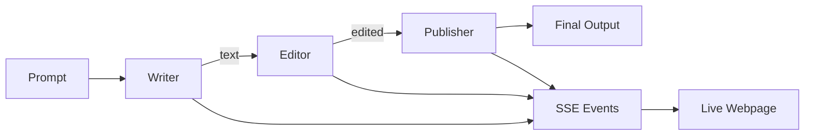
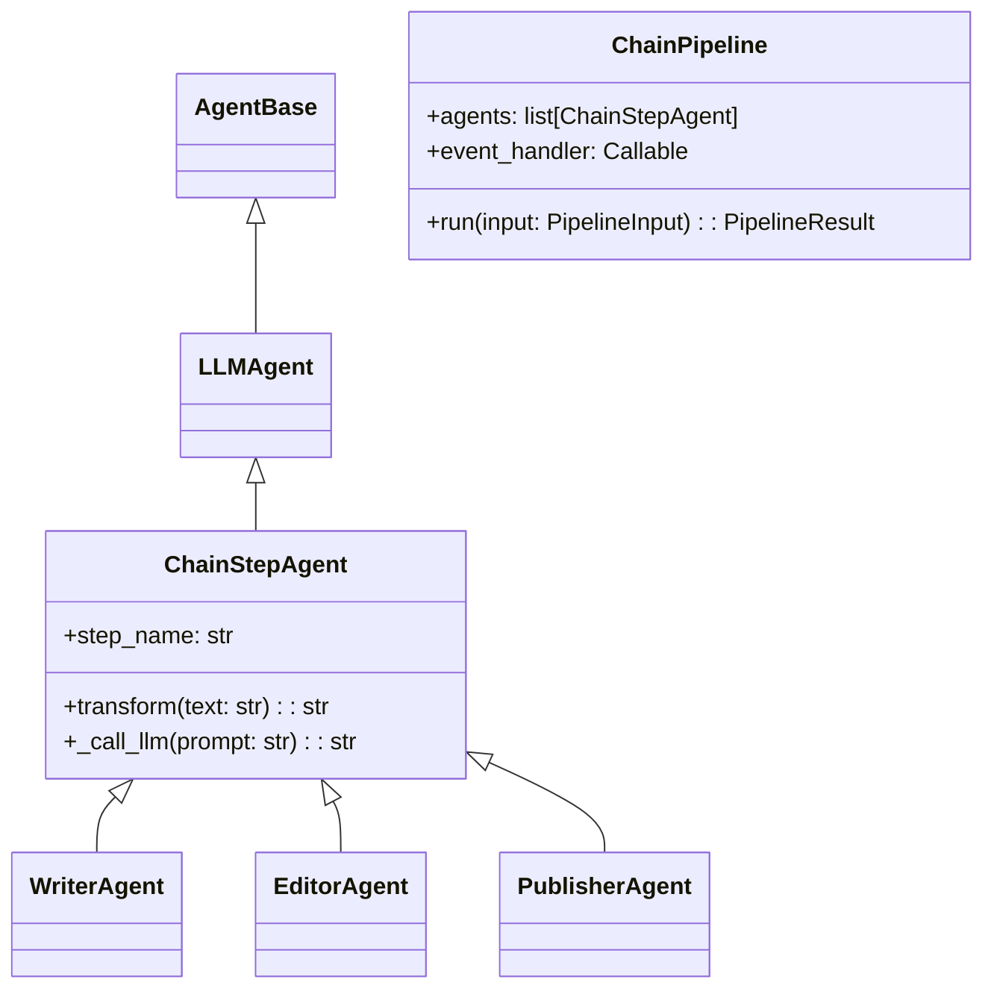

# Chain Pipeline Pattern

## Overview

The Chain Pipeline pattern demonstrates **sequential agent communication** where each agent transforms its input and passes the result to the next agent in the chain.



## Use Case: Document Processing

The demo implements a document processing pipeline:

1. **WriterAgent** - Generates initial draft text from a topic
2. **EditorAgent** - Improves style, grammar, and clarity
3. **PublisherAgent** - Formats for publication with title and sections

## Architecture

### Components

```
agents/chain/
├── __init__.py       # Public exports
├── models.py         # Pydantic models
├── base.py           # ChainStepAgent base class
├── writer.py         # WriterAgent
├── editor.py         # EditorAgent
├── publisher.py      # PublisherAgent
└── pipeline.py       # ChainPipeline orchestrator
```

### Class Hierarchy



## Data Models

### TokenUsage

```python
class TokenUsage(BaseModel):
    input_tokens: int = 0          # Tokens sent to LLM
    output_tokens: int = 0         # Tokens received from LLM

    @property
    def total_tokens(self) -> int:
        return self.input_tokens + self.output_tokens
```

### PipelineInput

```python
class PipelineInput(BaseModel):
    prompt: str                    # Topic to write about
    pipeline_id: str = auto()      # Unique identifier
    steps: list[str] = ["writer", "editor", "publisher"]
```

### StepResult

```python
class StepResult(BaseModel):
    step_name: str                 # "writer", "editor", "publisher"
    step_index: int                # 0, 1, 2
    input_text: str                # What the step received
    output_text: str               # What the step produced
    duration_ms: int               # Execution time
    model: str = ""                # LLM model used
    tokens: TokenUsage             # Token usage for this step
    timestamp: datetime
```

### PipelineResult

```python
class PipelineResult(BaseModel):
    pipeline_id: str
    prompt: str
    steps: list[StepResult]
    final_output: str
    total_duration_ms: int
    status: "pending" | "running" | "completed" | "failed"
    error: Optional[str]
```

### TransformResult (Internal)

```python
@dataclass
class TransformResult:
    text: str                      # Transformed text output
    model: str = ""                # Model used (e.g., "claude-sonnet-4-20250514")
    input_tokens: int = 0          # Input token count
    output_tokens: int = 0         # Output token count
```

## SSE Events

The pipeline broadcasts events via Server-Sent Events for real-time visualization:

| Event | Data | When |
|-------|------|------|
| `pipeline_started` | `{pipeline_id, prompt, steps[]}` | Pipeline begins |
| `step_started` | `{pipeline_id, step_index, step_name, model, input_preview, input_length}` | Agent starts |
| `step_completed` | `{pipeline_id, step_index, step_name, model, output, duration_ms, input_tokens, output_tokens, total_tokens}` | Agent finishes |
| `message_passed` | `{pipeline_id, from_step, to_step, content, content_length}` | Data flows |
| `pipeline_completed` | `{pipeline_id, status, final_output, total_duration_ms, error}` | Pipeline ends |
| `result` | `{pipeline_id, status, final_output, total_duration_ms, total_input_tokens, total_output_tokens}` | Final result |

## API Endpoints

| Method | Path | Description |
|--------|------|-------------|
| `POST` | `/api/chain/run` | Start pipeline with prompt |
| `GET` | `/api/chain/status/{id}` | Get pipeline status/result |
| `GET` | `/api/chain/agents` | List chain agents |
| `GET` | `/api/chain/events/{id}` | SSE stream for events |
| `GET` | `/static/chain/` | Demo webpage |

### Example: Run Pipeline

```bash
# Start pipeline
curl -X POST http://localhost:8000/api/chain/run \
  -H "Content-Type: application/json" \
  -d '{"prompt": "The impact of AI on healthcare"}'

# Response
{
  "pipeline_id": "abc12345",
  "status": "started",
  "message": "Pipeline started. Connect to /api/chain/events/abc12345 for updates."
}
```

### Example: SSE Events

```bash
curl -N http://localhost:8000/api/chain/events/abc12345

# Output (streaming)
event: connected
data: {"pipeline_id": "abc12345", "timestamp": "..."}

event: pipeline_started
data: {"pipeline_id": "abc12345", "prompt": "The impact...", "steps": ["writer", "editor", "publisher"]}

event: step_started
data: {"pipeline_id": "abc12345", "step_index": 0, "step_name": "writer", "input_preview": "The impact..."}

event: step_completed
data: {"pipeline_id": "abc12345", "step_index": 0, "step_name": "writer", "output": "...", "duration_ms": 1523}

# ... more events ...

event: result
data: {"pipeline_id": "abc12345", "status": "completed", "final_output": "# Title\n\n..."}
```

## Agent Implementation

Each chain agent extends `ChainStepAgent` and implements `transform()`:

```python
class WriterAgent(ChainStepAgent):
    step_name = "writer"

    def __init__(self, storage: StorageBase, model: str = "claude-sonnet-4-20250514"):
        super().__init__(
            agent_id="chain-writer",
            storage=storage,
            system_prompt="""Sei uno scrittore professionista.
            Quando ricevi un topic, genera un testo iniziale di 2-3 paragrafi...""",
            model=model
        )

    async def transform(self, text: str) -> str:
        return await self._call_llm(text)
```

## Pipeline Orchestration

The `ChainPipeline` class orchestrates sequential execution:

```python
class ChainPipeline:
    def __init__(
        self,
        storage: StorageBase,
        agents: list[ChainStepAgent],
        event_handler: Optional[Callable] = None
    ):
        self.agents = agents
        self.event_handler = event_handler

    async def run(self, input_data: PipelineInput) -> PipelineResult:
        current_text = input_data.prompt

        for index, agent in enumerate(self.agents):
            self._emit_event("step_started", {...})

            output_text = await agent.transform(current_text)

            self._emit_event("step_completed", {...})
            self._emit_event("message_passed", {...})

            current_text = output_text

        return PipelineResult(...)
```

## Error Handling

- Step failures are captured and the pipeline status becomes `"failed"`
- The error message is included in `PipelineResult.error`
- SSE broadcasts the error for UI notification
- Completed steps are preserved in the result

## Educational Value

This demo illustrates:

1. **Agent-to-Agent Communication** - `send_to_agent()` pattern
2. **Message Passing** - Content flows through the chain
3. **Lifecycle Phases** - think → transform → act visible in real-time
4. **Event Broadcasting** - SSE for live notifications
5. **Orchestration** - Pipeline manages sequencing and timing

## Testing

```bash
# Unit tests (mocked LLM)
pytest tests/unit/test_chain_agents.py -v

# Integration tests
pytest tests/integration/test_chain_pipeline.py -v

# E2E tests
pytest tests/e2e/test_chain_api.py -v
```

## Manual Testing

```bash
# 1. Start server
docker-compose up -d

# 2. Open browser
open http://localhost:8000/static/chain/

# 3. Enter a topic and click "Run Pipeline"
# 4. Watch the live visualization
```

## Frontend Visualization

The demo webpage (`/static/chain/`) provides real-time visualization with several components:

### KPI Dashboard

Real-time metrics displayed during pipeline execution:

| KPI | Description | Source |
|-----|-------------|--------|
| **Duration** | Total execution time | `step_completed.duration_ms` accumulated |
| **Input Tokens** | Total tokens sent to LLM | `step_completed.input_tokens` accumulated |
| **Output Tokens** | Total tokens received | `step_completed.output_tokens` accumulated |
| **Total Tokens** | Sum of input + output | Calculated |
| **Model** | LLM model used | `step_started.model` |
| **Est. Cost** | Estimated API cost | Calculated from tokens |

**Cost Calculation:**
```javascript
const COST_PER_1M_INPUT = 3.0;   // $3 per 1M input tokens
const COST_PER_1M_OUTPUT = 15.0; // $15 per 1M output tokens

const totalCost = (inputTokens / 1000000) * 3.0 + (outputTokens / 1000000) * 15.0;
```

### Pipeline Status Visualization

```
┌──────────┐      ┌──────────┐      ┌───────────┐
│  Writer  │  →   │  Editor  │  →   │ Publisher │
│ ✍️       │      │ 📝       │      │ 📰        │
│ Waiting  │      │ Waiting  │      │ Waiting   │
│          │      │          │      │           │
│ 📥 0|📤 0│      │ 📥 0|📤 0│      │ 📥 0|📤 0 │
└──────────┘      └──────────┘      └───────────┘
```

Each agent box shows:
- **Status**: Waiting → Processing → Done
- **Token usage**: Input and output tokens for this step
- **Visual feedback**: Border color changes (yellow=active, green=completed)

### Agent Communication View

Messages between agents displayed as chat bubbles:

```
┌─────────────────────────────────────────┐
│ Writer → Editor                         │
│ ┌─────────────────────────────────────┐ │
│ │ [Generated text content...]         │ │
│ │                                     │ │
│ └─────────────────────────────────────┘ │
│ 📝 1523 chars                           │
├─────────────────────────────────────────┤
│ Editor → Publisher                      │
│ ┌─────────────────────────────────────┐ │
│ │ [Edited text content...]            │ │
│ │                                     │ │
│ └─────────────────────────────────────┘ │
│ 📝 1847 chars                           │
└─────────────────────────────────────────┘
```

Color-coded by agent:
- **Writer** (purple): `#8b5cf6`
- **Editor** (cyan): `#06b6d4`
- **Publisher** (amber): `#f59e0b`

### Event Timeline

Chronological log of all pipeline events with expandable details:
- Click on `step_completed` events to see full step details
- Shows timestamps, durations, and token counts

## LLM Integration

### LiteLLM

The pipeline uses [LiteLLM](https://github.com/BerriAI/litellm) for unified LLM access:

```python
import litellm

response = await litellm.acompletion(
    model="claude-sonnet-4-20250514",
    messages=[
        {"role": "system", "content": system_prompt},
        {"role": "user", "content": user_prompt}
    ],
    max_tokens=1024
)

# Extract response and usage
text = response.choices[0].message.content
input_tokens = response.usage.prompt_tokens
output_tokens = response.usage.completion_tokens
```

**Configuration:**
```bash
# Set API key in environment
export ANTHROPIC_API_KEY="your-key-here"

# Or in docker-compose.yml
environment:
  ANTHROPIC_API_KEY: "${ANTHROPIC_API_KEY:-}"
```

**Benefits of LiteLLM:**
- Multi-provider support (Anthropic, OpenAI, Azure, etc.)
- Unified API interface
- Built-in retry logic
- Cost tracking

## Cost Estimate

Each pipeline run makes 3 Claude API calls (~500 tokens each):
- **Estimated cost per run**: ~$0.01-0.03
- **Model**: claude-sonnet-4-20250514 (configurable)

## Screenshots

### Demo Page Layout

```
┌─────────────────────────────────────────────────────────────┐
│                  Chain Pipeline Demo                        │
│         Document Processing: Writer → Editor → Publisher    │
├─────────────────────────────────────────────────────────────┤
│ Enter a topic: [________________________] [Run Pipeline]    │
├─────────────────────────────────────────────────────────────┤
│                     Pipeline Metrics                        │
│ ┌─────┐ ┌─────┐ ┌─────┐ ┌─────┐ ┌─────┐ ┌─────┐            │
│ │2.5s │ │1.2K │ │ 890 │ │2.1K │ │snnt │ │$0.02│            │
│ │Time │ │ In  │ │ Out │ │Total│ │Model│ │Cost │            │
│ └─────┘ └─────┘ └─────┘ └─────┘ └─────┘ └─────┘            │
├─────────────────────────────────────────────────────────────┤
│            [Writer] → [Editor] → [Publisher]                │
├─────────────────────────────────────────────────────────────┤
│                  Agent Communication                        │
│ ┌─────────────────────────────────────────────────────────┐ │
│ │ Writer → Editor: "..." (1523 chars)                     │ │
│ │ Editor → Publisher: "..." (1847 chars)                  │ │
│ └─────────────────────────────────────────────────────────┘ │
├─────────────────────────────────────────────────────────────┤
│                    Event Timeline                           │
├─────────────────────────────────────────────────────────────┤
│                     Final Output                            │
├─────────────────────────────────────────────────────────────┤
│                    Step Details                             │
└─────────────────────────────────────────────────────────────┘
```
