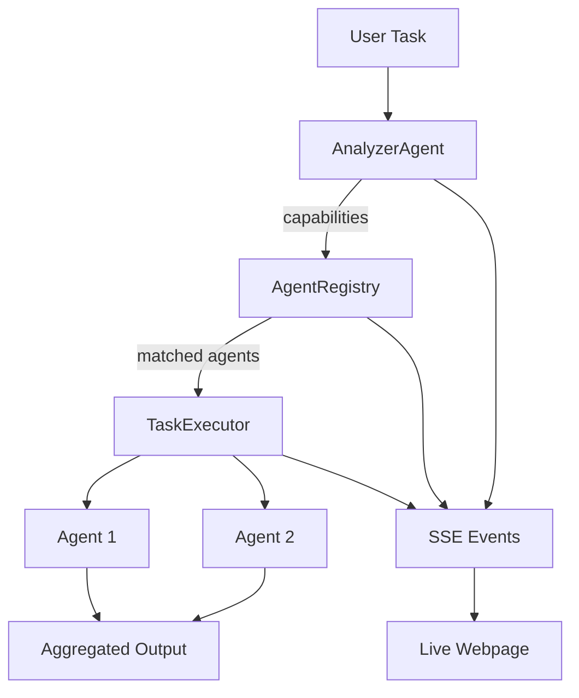
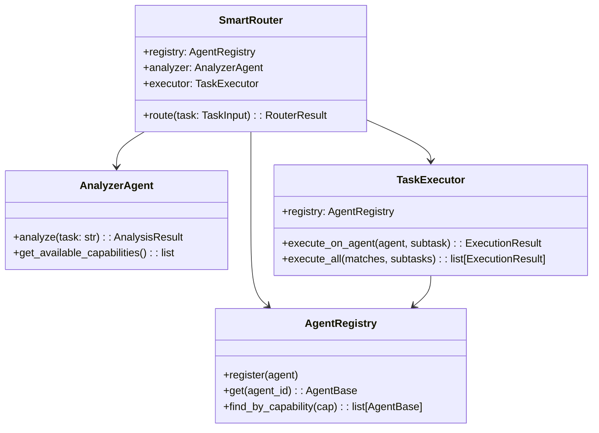
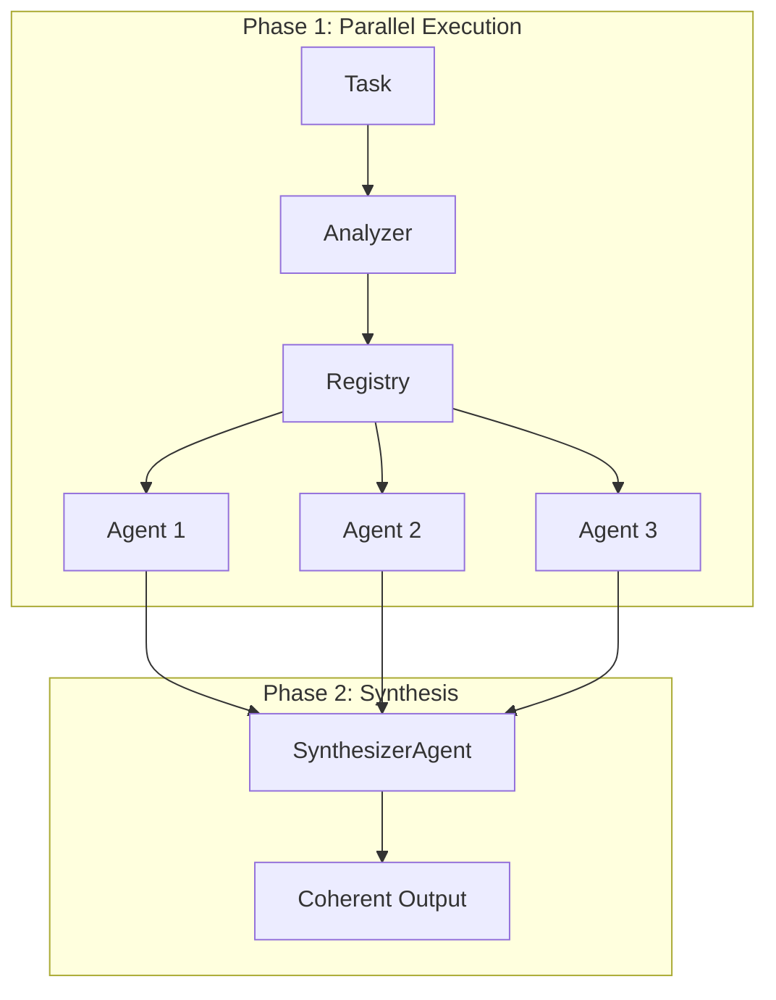

# Smart Task Router Pattern

## Overview

The Smart Task Router demonstrates **capability-based agent discovery** using the AgentRegistry. It analyzes user tasks, finds appropriate agents, and routes subtasks to them.



## Use Case: Intelligent Task Routing

The router implements a 3-step process:

1. **Analyze** - LLM extracts required capabilities from user task
2. **Discover** - Registry finds agents with matching capabilities
3. **Execute** - Subtasks are run on appropriate agents

---

## Complete Example: "calcola 15 * 3 e scrivi un haiku"

This section shows **real output** from a routing execution.

### Input

```
Task: "calcola 15 * 3 e scrivi un haiku sul risultato"
```

---

### Step 1: AnalyzerAgent (LLM)

**Role**: Extract required capabilities using Claude

| Metric | Value |
|--------|-------|
| Duration | ~3s |
| Model | claude-sonnet-4-5 |

**System Prompt**:
> "Sei un analizzatore di task. Identifica le capability richieste e suddividi in subtask."

**LLM Output**:
```json
{
    "capabilities": ["calculation", "creative_writing"],
    "subtasks": {
        "calculation": "calcola 15 * 3",
        "creative_writing": "scrivi un haiku sul numero 45"
    }
}
```

**What the Analyzer did**:
- Parsed natural language task
- Identified 2 distinct capabilities needed
- Created subtask descriptions for each

---

### Step 2: AgentRegistry Discovery

**Role**: Find agents with matching capabilities

```
┌─────────────────────────────────────────────────────────────────┐
│                      AgentRegistry                              │
├─────────────────────────────────────────────────────────────────┤
│                                                                 │
│  find_by_capability("calculation")                              │
│      └──► [CalculatorAgent] ✓                                   │
│                                                                 │
│  find_by_capability("creative_writing")                         │
│      └──► [WriterAgent] ✓                                       │
│                                                                 │
└─────────────────────────────────────────────────────────────────┘
```

**Discovery Results**:

| Capability | Matched Agents | Status |
|------------|----------------|--------|
| `calculation` | `calculator` | ✓ Found |
| `creative_writing` | `chain-writer` | ✓ Found |

**What the Registry did**:
- Searched registered agents by capability
- Returned matching agent IDs
- Enabled loose coupling (router doesn't know agents directly)

---

### Step 3: TaskExecutor

**Role**: Execute subtasks on matched agents

**Execution 1: CalculatorAgent**

| Metric | Value |
|--------|-------|
| Agent ID | `calculator` |
| Capability | `calculation` |
| Input | "calcola 15 * 3" |
| Output | "45" |
| Duration | <1ms |

**Execution 2: WriterAgent**

| Metric | Value |
|--------|-------|
| Agent ID | `chain-writer` |
| Capability | `creative_writing` |
| Input | "scrivi un haiku sul numero 45" |
| Output | "Quarantacinque / numeri che danzano lievi / nel vento d'estate" |
| Duration | ~5s |

---

### Final Aggregated Output

```
**calculation** (Calculator Agent):
45

---

**creative_writing** (Writer Agent):
Quarantacinque
numeri che danzano lievi
nel vento d'estate
```

### Routing Summary

```
┌────────────────────────────────────────────────────────────────────────┐
│                    ROUTING EXECUTION SUMMARY                           │
├────────────────────────────────────────────────────────────────────────┤
│  Input: "calcola 15 * 3 e scrivi un haiku sul risultato"              │
├──────────────┬──────────┬──────────────────────────────────────────────┤
│    Step      │ Duration │              Action                         │
├──────────────┼──────────┼──────────────────────────────────────────────┤
│ 1. Analyze   │   ~3s    │ LLM extracts capabilities                   │
│ 2. Discover  │   <1ms   │ Registry finds 2 agents                     │
│ 3. Execute   │   ~5s    │ Run subtasks on agents                      │
├──────────────┼──────────┼──────────────────────────────────────────────┤
│    TOTAL     │   ~8s    │ 2 capabilities, 2 agents                    │
└──────────────┴──────────┴──────────────────────────────────────────────┘
```

---

## Architecture

### Components

```
agents/router/
├── __init__.py       # Public exports
├── models.py         # Pydantic models
├── analyzer.py       # AnalyzerAgent (LLM-based)
├── executor.py       # TaskExecutor
└── router.py         # SmartRouter orchestrator
```

### Class Diagram



---

## Data Models

### TaskInput

```python
class TaskInput(BaseModel):
    task: str                      # User's task description
    task_id: str = auto()          # Unique identifier
    timestamp: datetime
```

### AnalysisResult

```python
class AnalysisResult(BaseModel):
    task_id: str
    original_task: str
    detected_capabilities: list[str]    # e.g., ["calculation", "creative_writing"]
    subtasks: dict[str, str]            # capability -> subtask description
    duration_ms: int
```

### CapabilityMatch

```python
class CapabilityMatch(BaseModel):
    capability: str                # e.g., "calculation"
    agent_ids: list[str]          # e.g., ["calculator"]
    matched: bool                 # True if agents found
```

### ExecutionResult

```python
class ExecutionResult(BaseModel):
    agent_id: str
    agent_name: str
    capability: str
    input_text: str
    output_text: str
    duration_ms: int
    success: bool
    error: Optional[str]
    tokens: dict                  # {"input": 0, "output": 0}
```

### RouterResult

```python
class RouterResult(BaseModel):
    task_id: str
    original_task: str
    analysis: AnalysisResult
    matches: list[CapabilityMatch]
    executions: list[ExecutionResult]
    final_output: str
    total_duration_ms: int
    status: str                   # pending, analyzing, discovering, executing, completed, failed
    error: Optional[str]
```

---

## Available Capabilities

| Capability | Description | Example Agents |
|------------|-------------|----------------|
| `calculation` | Math operations | CalculatorAgent |
| `echo` | Repeat messages | EchoAgent |
| `creative_writing` | Poetry, stories | WriterAgent |
| `text_editing` | Grammar, style | EditorAgent |
| `formatting` | Structure, markdown | PublisherAgent |

---

## SSE Events

| Event | Data | When |
|-------|------|------|
| `routing_started` | `{task_id, task}` | Routing begins |
| `analysis_started` | `{task_id}` | Analyzer starts |
| `analysis_completed` | `{task_id, capabilities[], subtasks}` | Capabilities extracted |
| `discovery_started` | `{task_id, capability}` | Registry search starts |
| `discovery_completed` | `{task_id, capability, agents[]}` | Agents found |
| `execution_started` | `{task_id, agent_id, subtask}` | Agent execution starts |
| `execution_completed` | `{task_id, agent_id, output, success}` | Agent execution done |
| `routing_completed` | `{task_id, status, total_duration_ms}` | Routing finished |
| `result` | `{...full RouterResult}` | Final result |

---

## API Endpoints

| Method | Path | Description |
|--------|------|-------------|
| `POST` | `/api/router/route` | Start routing a task |
| `GET` | `/api/router/status/{id}` | Get routing status/result |
| `GET` | `/api/router/events/{id}` | SSE stream for events |
| `GET` | `/api/router/registry` | List registered agents |
| `GET` | `/api/router/capabilities` | List available capabilities |
| `GET` | `/static/router/` | Demo webpage |

### Example: Route a Task

```bash
# Start routing
curl -X POST http://localhost:8000/api/router/route \
  -H "Content-Type: application/json" \
  -d '{"task": "calcola 7 * 8"}'

# Response
{
  "task_id": "abc12345",
  "status": "started",
  "message": "Routing started. Connect to /api/router/events/abc12345 for updates."
}
```

### Example: Get Registry

```bash
curl http://localhost:8000/api/router/registry

# Response
{
  "agents": [
    {"id": "echo", "name": "Echo Agent", "capabilities": ["echo"]},
    {"id": "calculator", "name": "Calculator Agent", "capabilities": ["calculation"]},
    {"id": "chain-writer", "name": "Writer Agent", "capabilities": ["creative_writing"]}
  ],
  "count": 3
}
```

---

## How Agents Are Discovered

### Registry Pattern

```
┌─────────────────────────────────────────────────────────────────┐
│                        SmartRouter                              │
│                                                                 │
│   1. Receive task: "calcola 7 * 8"                              │
│                           │                                     │
│                           ▼                                     │
│   2. AnalyzerAgent.analyze()                                    │
│      → capabilities: ["calculation"]                            │
│                           │                                     │
│                           ▼                                     │
│   3. Registry.find_by_capability("calculation")                 │
│      ┌─────────────────────────────────────────────────┐        │
│      │  Registry._agents:                              │        │
│      │    "echo" → EchoAgent [echo]           ✗        │        │
│      │    "calculator" → CalcAgent [calculation] ✓     │        │
│      │    "writer" → WriterAgent [creative_writing] ✗  │        │
│      └─────────────────────────────────────────────────┘        │
│      → returns: [CalculatorAgent]                               │
│                           │                                     │
│                           ▼                                     │
│   4. Executor.execute_on_agent(CalculatorAgent, "7 * 8")        │
│      → result: "56"                                             │
│                                                                 │
└─────────────────────────────────────────────────────────────────┘
```

### Why Registry-Based Discovery?

| Benefit | Description |
|---------|-------------|
| **Loose Coupling** | Router doesn't know agents directly |
| **Dynamic** | Agents can be added/removed at runtime |
| **Capability-Based** | Find by what agents CAN do, not who they ARE |
| **Extensible** | Add new capabilities without changing router |
| **Testable** | Easy to mock registry in tests |

---

## Agent Registration

Agents must be registered with their capabilities:

```python
# Register agents with capabilities
registry = AgentRegistry()

echo = EchoAgent("echo", storage)
echo.config.capabilities = ["echo"]
registry.register(echo)

calc = CalculatorAgent("calculator", storage)
calc.config.capabilities = ["calculation"]
registry.register(calc)

writer = WriterAgent("chain-writer", storage)
writer.config.capabilities = ["creative_writing"]
registry.register(writer)
```

---

## Frontend Visualization

### Demo Page Layout

```
┌─────────────────────────────────────────────────────────────────┐
│                    Smart Task Router                            │
│           Intelligent capability-based task routing             │
├─────────────────────────────────────────────────────────────────┤
│ Enter a task: [________________________________] [Route Task]   │
├─────────────────────────────────────┬───────────────────────────┤
│  STEPS                              │  AGENT REGISTRY           │
│  ─────                              │  ──────────────           │
│  ┌─────────────────────────────┐    │  ┌───────────────────┐    │
│  │ 1. Analyze Task             │    │  │ 🔊 echo           │    │
│  │    [calculation] [writing]  │    │  │ 🔢 calculator ◄── │    │
│  └─────────────────────────────┘    │  │ ✍️ writer    ◄── │    │
│  ┌─────────────────────────────┐    │  │ 📝 editor         │    │
│  │ 2. Discover Agents          │    │  └───────────────────┘    │
│  │    calculation → calculator │    │                           │
│  │    writing → writer         │    │  FINAL OUTPUT             │
│  └─────────────────────────────┘    │  ────────────             │
│  ┌─────────────────────────────┐    │  ┌───────────────────┐    │
│  │ 3. Execute Tasks            │    │  │ Result 1: 45      │    │
│  │    ✓ calculator: 45         │    │  │ Result 2: Haiku...│    │
│  │    ✓ writer: Haiku...       │    │  └───────────────────┘    │
│  └─────────────────────────────┘    │                           │
├─────────────────────────────────────┴───────────────────────────┤
│                        Event Timeline                           │
└─────────────────────────────────────────────────────────────────┘
```

---

## Comparison with Chain Pattern

| Aspect | Chain Pipeline | Smart Router |
|--------|----------------|--------------|
| **Flow** | Sequential (A→B→C) | Parallel by capability |
| **Coupling** | Fixed order | Dynamic discovery |
| **Agent Selection** | Hardcoded | Registry-based |
| **Use Case** | Document processing | Multi-skill tasks |
| **Communication** | Output→Input chain | Orchestrator-mediated |

---

## Two-Phase Execution (Context Preservation)

When multiple agents execute in parallel, their outputs are independent. To create a coherent final response, the router implements **Two-Phase Execution**.

### Architecture



### How It Works

1. **Phase 1**: All matched agents execute their subtasks in parallel
2. **Phase 2**: If multiple agents succeeded, SynthesizerAgent integrates their outputs

### SynthesizerAgent

The Synthesizer receives:
- Original task
- All execution results with agent context

It produces:
- Unified response that integrates all information
- Resolves contradictions
- Maintains coherent narrative

### Example: Complex Query

**Task**: "quanto costerebbe costruire un razzo spaziale? analizza pro e contro"

**Phase 1 (Parallel)**:
| Agent | Capability | Output |
|-------|------------|--------|
| EstimationAgent | `estimation` | Detailed cost breakdown ($500M - $5B) |
| AnalysisAgent | `analysis` | Pro/Contro analysis |

**Phase 2 (Synthesis)**:
- Synthesizer receives both outputs
- Creates unified response with:
  - Direct answer to cost question
  - Integrated cost details
  - Pro/Contro organized by category

### Limitation: No Cross-Agent Context

Agents in Phase 1 don't see each other's outputs. For example:

```
Task: "calcola 5+3 e scrivi un haiku sul risultato"

Phase 1:
  - Calculator: "8" ✓
  - Writer: writes about "7" ❌ (doesn't know result is 8!)

Phase 2:
  - Synthesizer integrates but can't fix the mismatch
```

**Solution**: For tasks requiring sequential context, use:
- Chain Pipeline pattern, or
- Dependency Graph (future enhancement)

### Available Specialist Agents

| Agent | Capabilities | Use Case |
|-------|--------------|----------|
| ResearchAgent | `research`, `knowledge` | Facts, history, science questions |
| EstimationAgent | `estimation`, `cost_analysis` | Cost, quantity, size estimates |
| AnalysisAgent | `analysis`, `reasoning` | Problem breakdown, pro/contro |
| TranslationAgent | `translation` | Language translation |
| SummaryAgent | `summarization` | Text summarization |

---

## Educational Points

1. **Service Discovery** - Registry as agent catalog
2. **Capability Matching** - Find agents by what they do
3. **LLM for Analysis** - AI understands task requirements
4. **Loose Coupling** - Agents don't know each other
5. **Dynamic Composition** - Different agents for different tasks
6. **Observability** - SSE events show entire flow

---

## Testing

```bash
# Unit tests (37 tests)
pytest tests/unit/test_router_*.py -v

# Test specific components
pytest tests/unit/test_router_models.py -v      # 16 tests
pytest tests/unit/test_router_analyzer.py -v    # 12 tests
pytest tests/unit/test_router_executor.py -v    # 9 tests
```

---

## Manual Testing

```bash
# 1. Start server
docker-compose up -d

# 2. Open browser
open http://localhost:8000/static/router/

# 3. Try these tasks:
#    - "calcola 5 + 3"
#    - "ripeti ciao"
#    - "scrivi una poesia sulla luna"
#    - "calcola 10 * 5 e scrivi un haiku"
```
